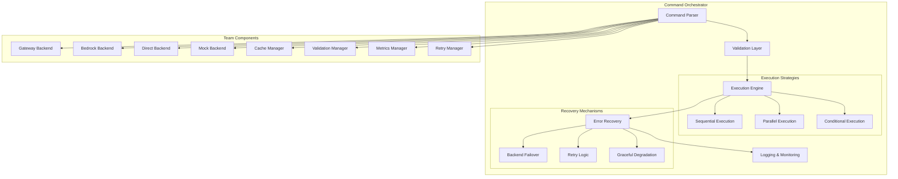

# TidyLLM CLI Commands Reference

**Complete command dictionary and orchestration documentation for team collaboration**

## 🎯 **Overview**

The TidyLLM CLI provides comprehensive commands for managing unified DSPy workflows, team collaboration, and production orchestration. This reference covers all commands, chaining mechanisms, error handling, and orchestrator behavior.

## 📋 **Command Categories**

### **1. Core DSPy Commands**
| Command | Description | Usage | Team Ownership |
|---------|-------------|-------|----------------|
| `tidyllm init` | Initialize new DSPy project | `tidyllm init [--backend=gateway]` | All Teams |
| `tidyllm create` | Create DSPy module | `tidyllm create "question -> answer"` | All Teams |
| `tidyllm compile` | Compile DSPy module | `tidyllm compile module.py` | All Teams |
| `tidyllm run` | Execute DSPy workflow | `tidyllm run --input="query" --config=prod.yaml` | All Teams |
| `tidyllm validate` | Validate DSPy module | `tidyllm validate module.py --test-data=tests/` | Team QA |

### **2. Backend Management Commands**
| Command | Description | Usage | Team Ownership |
|---------|-------------|-------|----------------|
| `tidyllm backend list` | List available backends | `tidyllm backend list` | All Teams |
| `tidyllm backend set` | Set active backend | `tidyllm backend set gateway --url=https://...` | Team Gateway |
| `tidyllm backend test` | Test backend connection | `tidyllm backend test bedrock --region=us-east-1` | Team AWS |
| `tidyllm backend health` | Check backend health | `tidyllm backend health --all` | Team Reliability |
| `tidyllm backend failover` | Trigger backend failover | `tidyllm backend failover --to=direct` | Team Reliability |

### **3. Feature Management Commands**
| Command | Description | Usage | Team Ownership |
|---------|-------------|-------|----------------|
| `tidyllm cache clear` | Clear cache | `tidyllm cache clear --pattern="query:*"` | Team Performance |
| `tidyllm cache stats` | Show cache statistics | `tidyllm cache stats --backend=redis` | Team Performance |
| `tidyllm retry config` | Configure retry policies | `tidyllm retry config --max-attempts=5` | Team Reliability |
| `tidyllm metrics export` | Export metrics | `tidyllm metrics export --format=prometheus` | Team Performance |
| `tidyllm validate config` | Validate configuration | `tidyllm validate config production.yaml` | Team QA |

### **4. Team Collaboration Commands**
| Command | Description | Usage | Team Ownership |
|---------|-------------|-------|----------------|
| `tidyllm team status` | Show team component status | `tidyllm team status --team=gateway` | All Teams |
| `tidyllm team sync` | Sync team components | `tidyllm team sync --from-main` | All Teams |
| `tidyllm team test` | Run team integration tests | `tidyllm team test --cross-team` | Team QA |
| `tidyllm team deploy` | Deploy team components | `tidyllm team deploy gateway --env=staging` | Team Gateway |
| `tidyllm team rollback` | Rollback team deployment | `tidyllm team rollback --version=1.2.3` | Team Reliability |

### **5. Migration and Integration Commands**
| Command | Description | Usage | Team Ownership |
|---------|-------------|-------|----------------|
| `tidyllm migrate` | Migrate from old patterns | `tidyllm migrate legacy/ --pattern=dspy_wrapper` | All Teams |
| `tidyllm integrate` | Integrate with main TidyLLM | `tidyllm integrate --target=main-repo/` | All Teams |
| `tidyllm benchmark` | Run performance benchmarks | `tidyllm benchmark --suite=comprehensive` | Team Performance |
| `tidyllm audit` | Generate audit reports | `tidyllm audit --compliance=enterprise` | Team Gateway |

## ⛓️ **Command Chaining Mechanisms**

### **1. Pipeline Chaining**
```bash
# Sequential execution with dependency checking
tidyllm backend set gateway | tidyllm cache clear | tidyllm run workflow.py

# Conditional chaining - only proceed if previous succeeds
tidyllm backend test bedrock && tidyllm run --backend=bedrock workflow.py

# Parallel execution for independent operations  
tidyllm cache stats & tidyllm metrics export & wait
```

### **2. Configuration Chaining**
```bash
# Chain configurations across commands
tidyllm config set --global backend=gateway \
  | tidyllm config set retry.max_attempts=5 \
  | tidyllm run workflow.py
```

### **3. Data Pipeline Chaining**
```bash
# Pass output from one command to next
tidyllm create "query -> analysis" \
  | tidyllm compile \
  | tidyllm validate --strict \
  | tidyllm deploy --env=production
```

## 🚨 **Chaining Failure Modes and Recovery**

### **1. Backend Failure Scenarios**

#### **Gateway Backend Failure**
```bash
# Command: tidyllm run --backend=gateway workflow.py
# Failure: Gateway unreachable (timeout, 503, connection refused)
# Auto-Recovery: Failover to Bedrock backend
# Retry Strategy: 3 attempts with exponential backoff
# Team Owner: Team Gateway + Team Reliability
```

**Failure Detection:**
- Connection timeout (30s default)
- HTTP status codes: 503, 502, 504
- Authentication failures (401, 403)
- Rate limiting (429)

**Recovery Actions:**
1. **Immediate**: Switch to Bedrock backend
2. **Log**: Failure details for Team Gateway analysis
3. **Alert**: Notify Team Gateway via monitoring
4. **Continue**: Execute workflow on backup backend

#### **Bedrock Backend Failure**
```bash
# Command: tidyllm run --backend=bedrock workflow.py  
# Failure: AWS service unavailable, quota exceeded, region issues
# Auto-Recovery: Failover to Direct (LiteLLM) backend
# Retry Strategy: Regional failover, then provider failover
# Team Owner: Team AWS + Team Reliability
```

**Failure Detection:**
- AWS service errors (ThrottlingException, ServiceUnavailable)
- Regional connectivity issues
- Quota/billing problems
- Model availability issues

**Recovery Actions:**
1. **Regional Failover**: Try different AWS region
2. **Provider Failover**: Switch to Direct backend 
3. **Degraded Mode**: Use Mock backend for testing
4. **Escalation**: Alert Team AWS for quota/billing issues

### **2. Feature Component Failures**

#### **Cache System Failure**
```bash
# Command: tidyllm run workflow.py (with caching enabled)
# Failure: Redis unavailable, memory exceeded, network partition
# Auto-Recovery: Disable caching, continue with direct execution
# Performance Impact: Increased latency, higher backend load
# Team Owner: Team Performance
```

**Graceful Degradation:**
- Disable cache reads/writes
- Continue workflow execution
- Log cache misses for analysis
- Monitor performance impact

#### **Validation Failure**
```bash
# Command: tidyllm run workflow.py --validate
# Failure: Response validation fails quality checks
# Auto-Recovery: Retry with different backend or relaxed validation
# Quality Impact: May affect output quality
# Team Owner: Team QA
```

**Quality Control:**
- Configurable validation strictness
- Fallback to basic validation
- Quality scoring and reporting
- Manual review triggers

### **3. Cross-Team Integration Failures**

#### **Team Component Unavailable**
```bash
# Command: tidyllm team test --cross-team
# Failure: One team's component unavailable during testing
# Auto-Recovery: Skip failing team's tests, continue with available
# Impact: Partial integration validation
# Team Owner: Team QA + Affected Team
```

**Integration Recovery:**
- Partial test execution
- Component dependency mapping
- Graceful degradation paths
- Team notification system

## 🎛️ **Orchestrator Architecture**

### **1. Command Orchestrator Core**



### **2. Error Propagation and Recovery**

#### **Error Classification**
```yaml
error_types:
  transient:
    - network_timeout
    - service_unavailable  
    - rate_limiting
    - temporary_quota_exceeded
    action: retry_with_backoff
    
  permanent:
    - authentication_failure
    - invalid_configuration
    - resource_not_found
    action: fail_fast_with_notification
    
  degradable:
    - cache_unavailable
    - validation_service_down
    - metrics_collection_failed
    action: continue_with_degraded_service
```

#### **Recovery Decision Tree**
```
Error Occurs
├── Is Error Transient?
│   ├── Yes: Apply Retry Strategy
│   │   ├── Success: Continue Execution
│   │   └── Max Retries: Try Fallback Backend
│   └── No: Is Error Degradable?
│       ├── Yes: Disable Component, Continue
│       └── No: Fail Fast, Notify Teams
```

### **3. Team-Specific Error Handling**

#### **Team Gateway Errors**
- **Enterprise authentication failures**: Fallback to direct backend
- **Governance policy violations**: Alert compliance team
- **Audit trail failures**: Continue with local logging

#### **Team AWS Errors**  
- **Regional failures**: Automatic region failover
- **Quota exceeded**: Alert billing team, use alternative backend
- **Model unavailable**: Fallback to compatible model

#### **Team Reliability Errors**
- **Circuit breaker open**: Respect backoff, try alternative
- **Retry exhausted**: Escalate to human intervention
- **Health check failures**: Remove from load balancing

#### **Team Performance Errors**
- **Cache miss storm**: Enable cache warming
- **Metrics collection down**: Continue with minimal telemetry  
- **Performance threshold exceeded**: Trigger auto-scaling

#### **Team QA Errors**
- **Validation failures**: Configurable fail/warn behavior
- **Test failures**: Block deployment, notify teams
- **Quality regression**: Automatic rollback triggers

### **4. Orchestrator Configuration**

```yaml
# orchestrator_config.yaml
orchestrator:
  execution:
    default_timeout: 300s
    max_parallel_commands: 10
    command_history_size: 1000
    
  error_handling:
    retry_strategy:
      max_attempts: 3
      backoff_multiplier: 2
      max_backoff: 60s
      
    failover:
      backend_priority: [gateway, bedrock, direct, mock]
      cross_region_failover: true
      
    degradation:
      cache_optional: true
      validation_optional: false
      metrics_optional: true
      
  team_coordination:
    cross_team_timeout: 120s
    integration_test_required: true
    deployment_approval_required: true
    
  monitoring:
    command_metrics: true
    error_rates: true
    performance_tracking: true
    team_health_monitoring: true
```

## 📊 **Command Success/Failure Metrics**

### **Key Performance Indicators**
- **Command Success Rate**: >99.5% target
- **Average Response Time**: <2s for simple commands, <30s for complex
- **Backend Failover Rate**: <1% of requests
- **Team Integration Success**: >95% cross-team compatibility

### **Error Rate Monitoring**
```yaml
alerts:
  high_error_rate:
    threshold: ">5% errors in 5 minutes"
    teams: [reliability, affected_component_teams]
    
  backend_failover:
    threshold: ">10 failovers in 1 hour"
    teams: [reliability, gateway, aws]
    
  integration_failure:
    threshold: ">1 cross-team failure"
    teams: [qa, all_teams]
```

## 🔧 **Debugging and Troubleshooting**

### **Debug Commands**
```bash
# Enable verbose logging
tidyllm --verbose --log-level=DEBUG run workflow.py

# Trace command execution
tidyllm --trace run workflow.py

# Test individual components
tidyllm component test gateway --health-check
tidyllm component test cache --connectivity

# Simulate failures for testing
tidyllm simulate failure backend --type=timeout
tidyllm simulate failure cache --type=unavailable
```

### **Common Issues and Solutions**

#### **Issue: Command Hangs**
```bash
# Check: Process status
tidyllm status --processes

# Solution: Kill stuck processes
tidyllm kill --process-id=12345

# Prevention: Set appropriate timeouts
tidyllm config set global.command_timeout=60s
```

#### **Issue: Authentication Failures**
```bash
# Check: Current authentication status
tidyllm auth status --all-backends

# Solution: Refresh authentication  
tidyllm auth refresh --backend=gateway
tidyllm auth login --backend=bedrock --profile=production
```

#### **Issue: Performance Degradation**
```bash
# Check: Component performance
tidyllm performance check --detailed

# Solution: Clear caches and restart
tidyllm cache clear --all
tidyllm restart --components=cache,metrics
```

## 🎉 **Best Practices for Teams**

### **Command Usage Guidelines**
1. **Always use timeouts** for production commands
2. **Chain commands carefully** - understand dependencies
3. **Monitor error rates** for your team's components  
4. **Test failover scenarios** regularly
5. **Document custom commands** and team-specific workflows

### **Error Handling Best Practices**
1. **Implement graceful degradation** for non-critical features
2. **Provide meaningful error messages** with recovery suggestions
3. **Log errors appropriately** for troubleshooting
4. **Test error scenarios** in integration tests
5. **Coordinate with other teams** for cross-component failures

### **Team Coordination**
1. **Use team-specific prefixes** for custom commands
2. **Follow naming conventions** for consistency
3. **Share error handling patterns** across teams
4. **Participate in cross-team testing** regularly
5. **Update documentation** when adding new commands

---

## 🚀 **CLI Command Infrastructure Complete**

This comprehensive CLI reference provides teams with:
- **Complete command dictionary** with ownership mapping
- **Detailed chaining mechanisms** and failure modes
- **Comprehensive error orchestration** and recovery strategies
- **Team-specific error handling** patterns
- **Production-ready debugging** and monitoring tools

**Teams now have the infrastructure documentation needed for effective collaboration and production operations!**