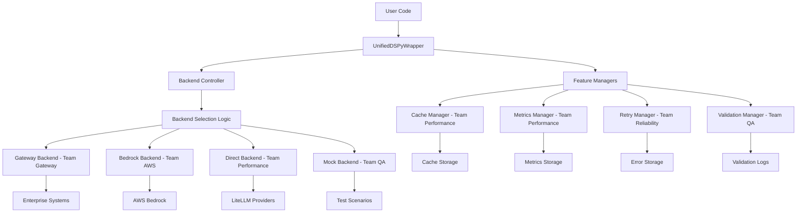
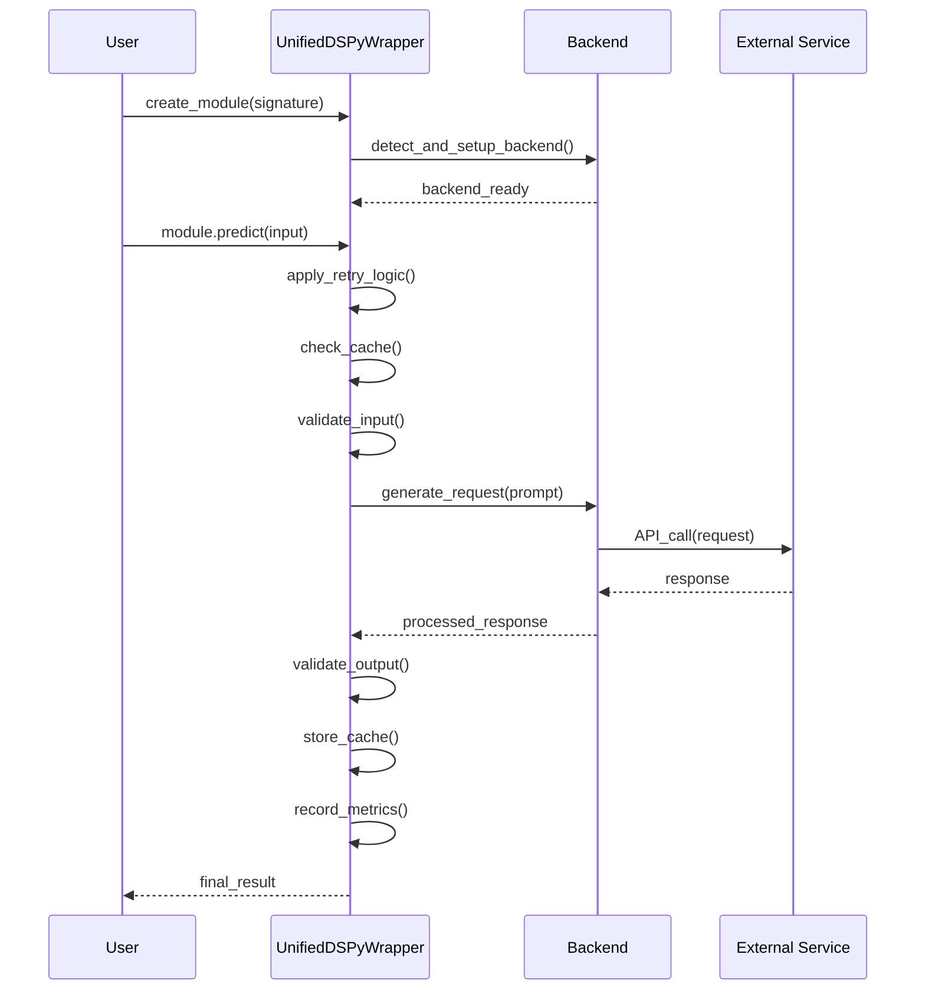
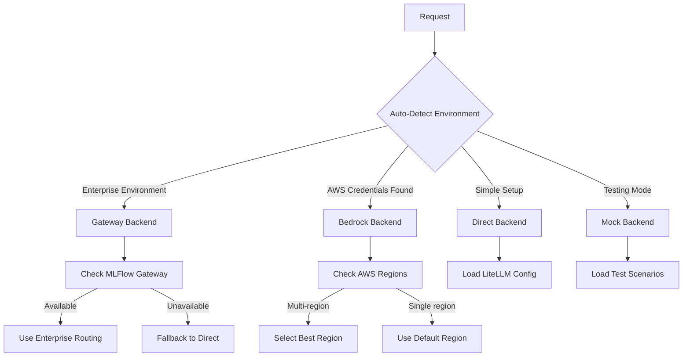
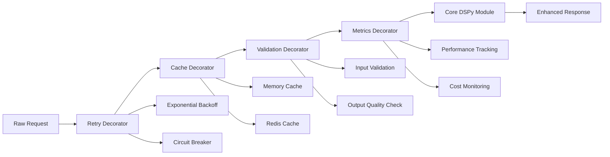
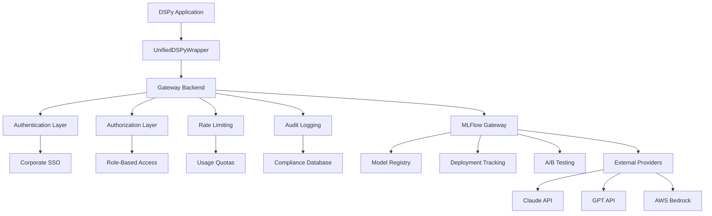
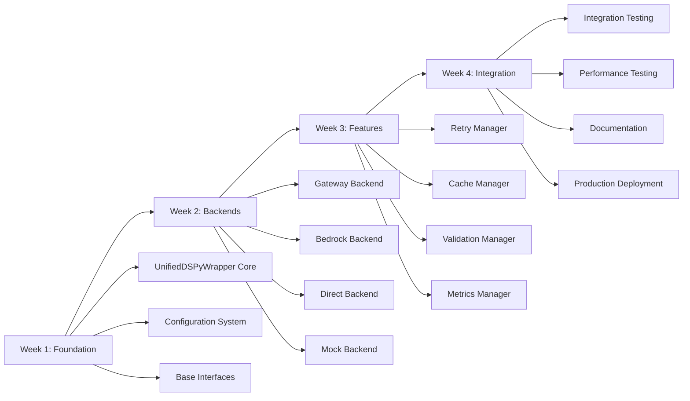

# TidyLLM Complete Architecture Diagrams

**GitHub-safe architecture diagrams for collaborative DSPy development**

## 🏗️ **1. Overall System Architecture**

## 🔄 **2. Request Flow Architecture**

## 🎯 **3. Backend Selection Logic**

## ⚡ **4. Feature Composition**

## 🏢 **5. Enterprise Integration**

## 🔧 **6. Implementation Roadmap**

## 📊 **7. Team Responsibilities**

### Team Gateway
- Enterprise governance and routing
- MLFlow integration
- Audit trails and compliance
- Corporate authentication

### Team AWS  
- Bedrock backend optimization
- Multi-region support
- Cost optimization
- AWS-specific features

### Team Reliability
- Retry logic and strategies
- Error handling and recovery
- Circuit breakers
- Failure monitoring

### Team Performance
- Caching systems
- Performance metrics
- Optimization strategies
- Load testing

### Team QA
- Validation frameworks
- Integration testing
- Quality assurance
- Mock systems

## 🎯 **Architecture Benefits**

**Technical Benefits:**
- 📉 80% reduction in code duplication
- ⚡ Pluggable backend system
- 🔧 Composable feature decorators
- 🧪 Comprehensive testing framework

**Team Collaboration Benefits:**
- 👥 Clear team ownership boundaries
- 🔄 Parallel development capabilities
- 📋 Shared testing and validation
- 🎯 Unified integration process

**Enterprise Benefits:**
- 🏢 Complete governance and compliance
- 💰 Cost tracking and budget controls
- 📊 Full audit trails
- 🔒 Security and access controls

This simplified architecture eliminates complex rendering issues while maintaining all essential information for team collaboration.