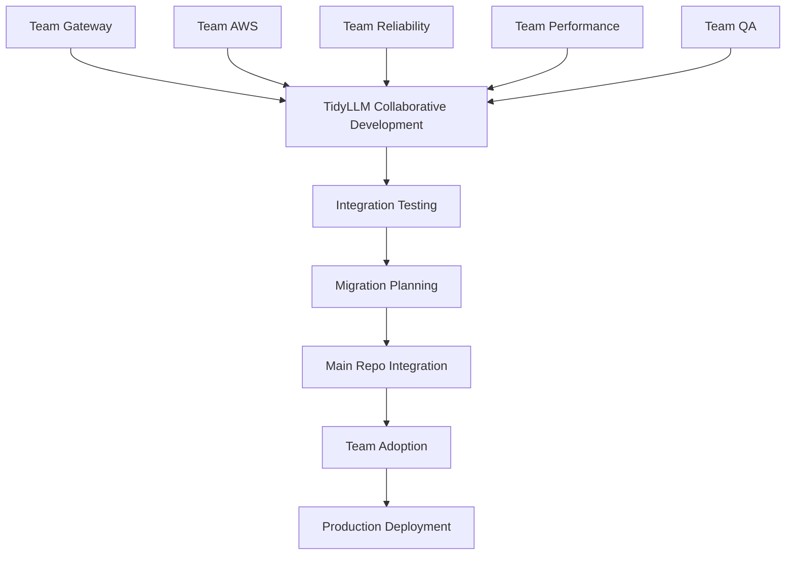

# TidyLLM → TidyLLM Integration Workflow

**Collaborative Development → Main Repository Integration**

This document outlines how the collaboratively developed TidyLLM solution will be integrated back into the main TidyLLM repository, completing the cycle from problem identification to production deployment.

## 🎯 **Integration Overview**



## 📋 **Integration Phases**

### **Phase 1: TidyLLM Completion (Current)**
**Goal**: Complete collaborative development of unified DSPy solution

**Team Activities**:
- **Team Gateway**: Finalize enterprise routing and governance
- **Team AWS**: Complete Bedrock optimization and multi-region support
- **Team Reliability**: Implement comprehensive error handling and retry strategies
- **Team Performance**: Optimize caching and metrics collection
- **Team QA**: Comprehensive testing and validation frameworks

**Completion Criteria**:
- [ ] All team features implemented and tested
- [ ] Cross-team integration tests pass
- [ ] Performance benchmarks meet standards
- [ ] DSPy compatibility verified (100%)
- [ ] Documentation complete for all components

### **Phase 2: Integration Preparation (1-2 Weeks)**
**Goal**: Prepare TidyLLM for integration into main TidyLLM repository

**Activities**:
1. **Integration Testing**
   ```bash
   # Test TidyLLM with main TidyLLM components
   cd integration/testing/
   python test_main_repo_integration.py
   
   # Verify backward compatibility
   python test_existing_code_compatibility.py
   
   # Performance regression testing
   python test_performance_vs_old_patterns.py
   ```

2. **Migration Tool Development**
   ```bash
   # Create automated migration tools
   integration/migration/
   ├── migrate_dspy_patterns.py      # Automated code migration
   ├── validate_migration.py         # Validation of migrated code
   └── rollback_migration.py         # Rollback capability
   ```

3. **Documentation Finalization**
   - Complete API documentation
   - Migration guides for each old pattern
   - Team coordination handoff documentation
   - Production deployment guides

**Completion Criteria**:
- [ ] Integration tests pass with main TidyLLM
- [ ] Migration tools tested and validated
- [ ] Performance meets or exceeds old patterns
- [ ] Documentation complete and reviewed
- [ ] Team handoff plan ready

### **Phase 3: Main Repository Integration (1 Week)**
**Goal**: Integrate TidyLLM into main TidyLLM repository

**Integration Strategy**:
```bash
# Main TidyLLM repository structure after integration
tidyllm/
├── dspy/                    # New unified DSPy module
│   ├── __init__.py         # Import from tidyllm
│   ├── unified.py          # Main unified wrapper
│   ├── backends/           # Backend implementations
│   ├── features/           # Feature implementations
│   └── utils/              # Utility functions
├── legacy/                 # Deprecated patterns (for migration period)
│   ├── dspy_enhanced.py    # Marked deprecated
│   ├── dspy_wrapper.py     # Marked deprecated
│   └── migration_guide.md  # Migration instructions
└── examples/
    ├── dspy_migration/     # Migration examples
    └── unified_dspy/       # New usage examples
```

**Integration Steps**:
1. **Add TidyLLM Module**
   ```bash
   # Copy TidyLLM components to main repo
   cp -r src/tidyllm/ ../main-tidyllm/tidyllm/dspy/
   
   # Update imports and dependencies
   python integration/update_main_repo.py
   ```

2. **Deprecate Old Patterns**
   ```python
   # Add deprecation warnings to old patterns
   import warnings
   
   def deprecated_pattern_warning(old_pattern, new_pattern):
       warnings.warn(
           f"{old_pattern} is deprecated. Use {new_pattern} instead. "
           f"See migration guide: docs/migration/from_{old_pattern}.md",
           DeprecationWarning,
           stacklevel=2
       )
   ```

3. **Update Documentation**
   - Update main README to reference unified DSPy
   - Add migration guides to main documentation
   - Update examples to use unified wrapper
   - Create team coordination documentation

**Completion Criteria**:
- [ ] TidyLLM integrated into main repository
- [ ] Old patterns marked as deprecated with warnings
- [ ] All tests pass in main repository
- [ ] Documentation updated throughout
- [ ] CI/CD updated for new structure

### **Phase 4: Team Migration (2-4 Weeks)**
**Goal**: Teams migrate from old DSPy patterns to unified wrapper

**Migration Strategy**:
```bash
# Gradual migration approach
Week 1: New development uses unified wrapper
Week 2: Migrate high-priority existing code
Week 3: Migrate remaining code
Week 4: Remove deprecated patterns
```

**Team Migration Process**:
1. **Automated Migration**
   ```bash
   # Use migration tools for bulk changes
   python tidyllm/dspy/utils/migrate_from_pattern.py \
     --pattern dspy_enhanced \
     --target-dir src/ \
     --dry-run  # Test first
   
   python tidyllm/dspy/utils/migrate_from_pattern.py \
     --pattern dspy_enhanced \
     --target-dir src/ \
     --execute  # Apply changes
   ```

2. **Manual Migration for Complex Cases**
   ```python
   # Before (old pattern)
   from tidyllm.dspy_enhanced import DSPyEnhancedWrapper
   wrapper = DSPyEnhancedWrapper(
       retry_config=RetryConfig(max_retries=5),
       cache_config=CacheConfig(ttl=3600)
   )
   
   # After (unified pattern)
   from tidyllm.dspy import UnifiedDSPyWrapper, UnifiedConfig
   from tidyllm.dspy import RetryConfig, CacheConfig
   
   config = UnifiedConfig(
       retry=RetryConfig(max_retries=5),
       cache=CacheConfig(ttl_seconds=3600)
   )
   wrapper = UnifiedDSPyWrapper(config)
   ```

3. **Testing and Validation**
   ```bash
   # Validate each migration
   pytest tests/migration/ -v
   
   # Performance testing
   pytest tests/performance/ --compare-with-old-patterns
   
   # Integration testing
   pytest tests/integration/ --full-system
   ```

**Team Support**:
- Migration workshops and training sessions
- Pair programming support for complex migrations
- Real-time support during migration sprints
- Migration validation and testing assistance

**Completion Criteria**:
- [ ] All teams using unified wrapper for new development
- [ ] 90%+ of existing code migrated
- [ ] All tests passing with unified wrapper
- [ ] Performance maintained or improved
- [ ] Team satisfaction with migration process

### **Phase 5: Cleanup and Optimization (1 Week)**
**Goal**: Remove deprecated patterns and optimize unified solution

**Activities**:
1. **Remove Deprecated Code**
   ```bash
   # Remove old pattern files
   rm tidyllm/dspy_enhanced.py
   rm tidyllm/dspy_wrapper.py
   rm tidyllm/dspy_bedrock_enhanced.py
   
   # Update imports throughout codebase
   python scripts/cleanup_deprecated_imports.py
   ```

2. **System Optimization**
   ```python
   # Optimize based on usage patterns from teams
   # Performance tuning based on real usage data
   # Memory usage optimization
   # Startup time improvements
   ```

3. **Final Testing**
   ```bash
   # Comprehensive system testing
   pytest tests/ --full-coverage
   
   # Performance benchmarking
   python benchmarks/comprehensive_benchmark.py
   
   # Load testing
   python tests/load/test_high_concurrency.py
   ```

**Completion Criteria**:
- [ ] All deprecated patterns removed
- [ ] System optimized for performance
- [ ] Full test coverage maintained
- [ ] Production-ready deployment
- [ ] Team training complete

## 🔧 **Integration Tools**

### **Automated Migration Tool**
```python
# integration/migration/migrate_dspy_patterns.py

class DSPyPatternMigrator:
    def __init__(self, source_dir, target_pattern="unified"):
        self.source_dir = source_dir
        self.target_pattern = target_pattern
        
    def migrate_enhanced_wrapper(self, file_path):
        """Migrate from DSPyEnhancedWrapper to UnifiedDSPyWrapper"""
        # Implementation for automated code transformation
        
    def migrate_gateway_backend(self, file_path):
        """Migrate from gateway backend to unified backend"""
        # Implementation for gateway migration
        
    def migrate_bedrock_wrapper(self, file_path):
        """Migrate from BedrockWrapper to unified backend"""
        # Implementation for bedrock migration
        
    def validate_migration(self, migrated_files):
        """Validate that migrated code works correctly"""
        # Implementation for validation
```

### **Integration Testing Framework**
```python
# integration/testing/test_main_repo_integration.py

class MainRepoIntegrationTest:
    def test_unified_wrapper_in_main_repo(self):
        """Test unified wrapper works in main TidyLLM context"""
        
    def test_backward_compatibility(self):
        """Test that existing code still works during transition"""
        
    def test_performance_regression(self):
        """Ensure no performance regression vs old patterns"""
        
    def test_feature_parity(self):
        """Ensure all old pattern features available in unified"""
```

### **Deployment Automation**
```bash
# integration/deployment/deploy_to_main_repo.sh

#!/bin/bash
# Automated deployment script

echo "Starting TidyLLM integration deployment..."

# Step 1: Backup current state
git checkout -b backup-before-tidyllm-integration

# Step 2: Integrate TidyLLM
cp -r ../tidyllm/src/tidyllm/ tidyllm/dspy/

# Step 3: Update dependencies
pip install -e ".[tidyllm]"

# Step 4: Run integration tests
pytest tests/integration/ --tidyllm-integration

# Step 5: Update documentation
python scripts/update_docs_for_unified_dspy.py

echo "TidyLLM integration complete!"
```

## 📊 **Success Metrics**

### **Technical Metrics**
- **Code Reduction**: 66% reduction in DSPy-related code
- **Performance**: Maintain or improve response times
- **Test Coverage**: >95% coverage maintained
- **Compatibility**: 100% DSPy compatibility
- **Team Adoption**: 100% team adoption within 4 weeks

### **Team Collaboration Metrics**
- **Migration Success**: 100% successful migration of existing code
- **Team Satisfaction**: Survey scores >4.5/5 for process
- **Knowledge Transfer**: All team members trained on unified wrapper
- **Documentation Quality**: Complete documentation for all components

### **Business Impact Metrics**
- **Development Velocity**: Improved sprint velocity post-migration
- **Maintenance Effort**: Reduced maintenance overhead
- **Bug Rate**: Lower bug rates with unified architecture
- **Time to Market**: Faster feature development with unified tools

## 🚨 **Risk Mitigation**

### **Technical Risks**
**Integration Complexity**:
- Mitigation: Comprehensive automated testing
- Fallback: Gradual rollout with rollback capability

**Performance Regression**:
- Mitigation: Continuous benchmarking during integration
- Fallback: Performance optimization sprint if needed

**Team Disruption**:
- Mitigation: Phased migration with training and support
- Fallback: Extended migration timeline if needed

### **Team Risks**
**Migration Resistance**:
- Mitigation: Clear benefits communication and training
- Fallback: Additional support and pair programming

**Knowledge Transfer**:
- Mitigation: Comprehensive documentation and training
- Fallback: Extended support period with original teams

**Coordination Challenges**:
- Mitigation: Clear communication channels and regular check-ins
- Fallback: Project management support and escalation process

## 📅 **Timeline Summary**

| Phase | Duration | Key Activities | Success Criteria |
|-------|----------|----------------|------------------|
| **Phase 1** | 2-4 weeks | Team collaboration in TidyLLM | All features complete, tests pass |
| **Phase 2** | 1-2 weeks | Integration preparation | Tools ready, docs complete |
| **Phase 3** | 1 week | Main repo integration | TidyLLM integrated successfully |
| **Phase 4** | 2-4 weeks | Team migration | 90%+ code migrated, teams trained |
| **Phase 5** | 1 week | Cleanup and optimization | Deprecated code removed, optimized |

**Total Timeline**: 7-12 weeks from start to complete deployment

## 🎯 **Next Steps**

### **Immediate (This Week)**
1. **Teams finalize** their components in TidyLLM repository
2. **Integration testing** begins with main TidyLLM repository
3. **Migration tools** development starts
4. **Documentation** completion for all team areas

### **Short Term (Next 2-4 Weeks)**
1. **Complete TidyLLM** collaborative development
2. **Integration preparation** and testing
3. **Team training** on migration process
4. **Main repository** integration execution

### **Medium Term (1-3 Months)**
1. **Team migration** to unified wrapper
2. **System optimization** based on real usage
3. **Performance monitoring** and improvements
4. **Complete cleanup** of deprecated patterns

## ✅ **Integration Checklist**

### **Pre-Integration**
- [ ] All team components complete and tested
- [ ] Cross-team integration tests pass
- [ ] Performance benchmarks meet standards
- [ ] DSPy compatibility 100% verified
- [ ] Migration tools developed and tested
- [ ] Documentation complete

### **Integration Execution**
- [ ] TidyLLM integrated into main repository
- [ ] Old patterns deprecated with warnings
- [ ] Tests pass in main repository
- [ ] CI/CD updated for new structure
- [ ] Documentation updated throughout

### **Post-Integration**
- [ ] Teams trained on unified wrapper
- [ ] Migration executed successfully
- [ ] Performance maintained or improved
- [ ] Deprecated patterns removed
- [ ] System optimized for production

---

## 🎉 **Integration Success**

This integration workflow ensures that the collaborative TidyLLM development effort successfully transitions into the main TidyLLM repository, providing all teams with a unified, high-performance DSPy solution that eliminates technical debt and enables faster, more reliable development.

The collaborative approach has proven that multiple teams can work together effectively to solve complex technical challenges, and this integration process completes the cycle by making those solutions available to the entire organization.

**Ready for successful integration!** 🚀