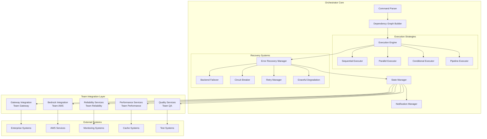
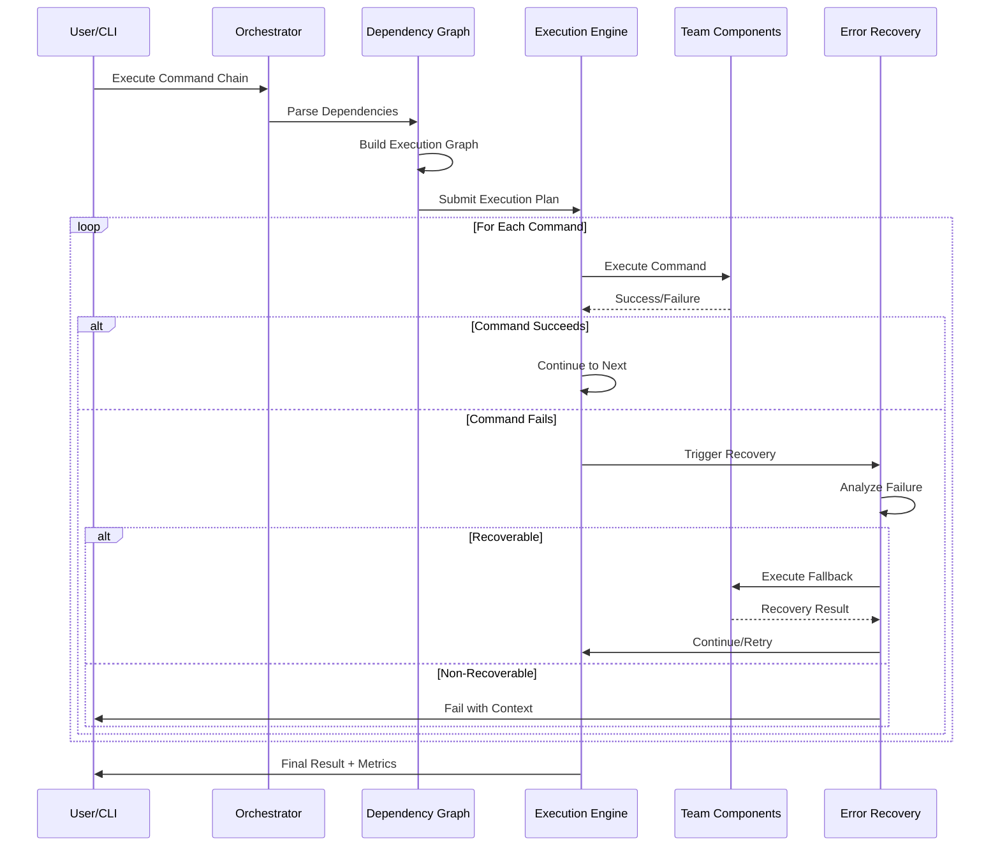
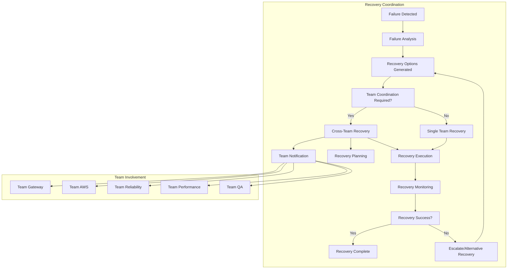

# TidyLLM Orchestrator Deep Dive

**Advanced orchestration, chaining, and error recovery mechanisms**

## 🎯 **Orchestrator Overview**

The TidyLLM Orchestrator is the central command execution engine that manages:
- Complex command chaining and dependencies
- Multi-team component coordination  
- Intelligent error recovery and failover
- Production-grade reliability and monitoring

## 🏗️ **Orchestrator Architecture**

### **1. Core Components**



### **2. Command Lifecycle Management**



## ⛓️ **Advanced Chaining Mechanisms**

### **1. Dependency-Aware Execution**

#### **Complex Dependency Chain**
```bash
# Multi-step workflow with dependencies
tidyllm workflow define "ml_pipeline" \
  --step="data_prep: backend test && cache clear" \
  --step="model_train: data_prep.success && backend set bedrock" \
  --step="validation: model_train.success && validate enable --strict" \
  --step="deployment: validation.quality_score > 0.95"
```

#### **Conditional Dependencies**
```yaml
# workflow_config.yaml
dependencies:
  data_preparation:
    requires: []
    conditions:
      - backend_health: "gateway OR bedrock OR direct"
      - cache_available: optional
      
  model_training:
    requires: [data_preparation]
    conditions:
      - backend_type: "bedrock OR direct"  # Gateway insufficient for training
      - memory_available: "> 4GB"
      - timeout: "< 1800s"
      
  quality_validation:
    requires: [model_training]
    conditions:
      - validation_service: available
      - quality_threshold: "> 0.90"
      
  production_deployment:
    requires: [quality_validation]
    conditions:
      - validation_score: "> 0.95"
      - approval_status: "approved"
      - deployment_window: "business_hours OR maintenance_window"
```

### **2. Parallel Execution with Synchronization**

#### **Team Coordination Pattern**
```bash
# Parallel team component testing
tidyllm coordinate \
  --parallel "team_gateway: backend test gateway" \
  --parallel "team_aws: backend test bedrock --all-regions" \
  --parallel "team_performance: cache benchmark --comprehensive" \
  --parallel "team_qa: validate test-suite --integration" \
  --sync-point "all_teams_ready" \
  --then "integration_test --cross-team"
```

#### **Resource-Aware Parallelism**
```yaml
# Orchestrator manages resource allocation
parallel_execution:
  max_concurrent: 8
  resource_limits:
    memory_per_task: "2GB"
    cpu_per_task: "2 cores"
    network_bandwidth: "100Mbps per task"
    
  load_balancing:
    strategy: "least_loaded"
    health_check_interval: "30s"
    
  synchronization:
    barrier_timeout: "300s"
    partial_success_threshold: "80%"  # Continue if 80% of parallel tasks succeed
```

### **3. Pipeline Execution with State Management**

#### **Stateful Pipeline**
```bash
# Pipeline maintains state across commands
tidyllm pipeline create "ml_workflow" \
  | stage "data_ingestion" --state-key="dataset_version" \
  | stage "preprocessing" --depends="dataset_version" --state-key="processed_data" \
  | stage "training" --depends="processed_data" --state-key="model_artifacts" \
  | stage "validation" --depends="model_artifacts" --state-key="validation_results" \
  | stage "deployment" --depends="validation_results" --condition="quality > 0.95"
```

#### **Pipeline State Persistence**
```yaml
# State management configuration
pipeline_state:
  storage_backend: "redis"  # or "database", "file_system"
  state_retention: "30 days"
  checkpoint_frequency: "per_stage"
  
  recovery:
    auto_resume: true
    resume_from_checkpoint: true
    max_resume_attempts: 3
    
  monitoring:
    state_size_limit: "100MB"
    performance_tracking: true
    state_corruption_detection: true
```

## 🚨 **Comprehensive Error Recovery**

### **1. Multi-Level Error Classification**

```python
# Error classification system
class ErrorClassification:
    TRANSIENT_NETWORK = {
        "codes": ["ConnectionTimeout", "TemporaryUnavailable", "RateLimited"],
        "recovery": "exponential_backoff_retry",
        "max_attempts": 5,
        "escalation_threshold": 3
    }
    
    BACKEND_FAILURES = {
        "codes": ["ServiceUnavailable", "InternalServerError", "BadGateway"],
        "recovery": "backend_failover",
        "failover_sequence": ["gateway", "bedrock", "direct", "mock"],
        "health_check_required": True
    }
    
    AUTHENTICATION_ERRORS = {
        "codes": ["Unauthorized", "Forbidden", "TokenExpired"],
        "recovery": "auth_refresh_then_retry",
        "max_refresh_attempts": 2,
        "fallback": "degraded_mode"
    }
    
    RESOURCE_CONSTRAINTS = {
        "codes": ["QuotaExceeded", "RateLimited", "InsufficientResources"],
        "recovery": "resource_aware_backoff",
        "alternative_resources": True,
        "cost_optimization": True
    }
    
    PERMANENT_FAILURES = {
        "codes": ["InvalidConfiguration", "ResourceNotFound", "PermissionDenied"],
        "recovery": "fail_fast_with_context",
        "notification_required": True,
        "manual_intervention": True
    }
```

### **2. Team-Specific Recovery Strategies**

#### **Team Gateway Recovery**
```yaml
gateway_recovery:
  enterprise_auth_failure:
    - action: "try_backup_auth_service"
    - fallback: "local_authentication_cache"
    - escalation: "notify_enterprise_admin"
    
  governance_policy_violation:
    - action: "apply_policy_exception"
    - condition: "if_development_environment"
    - fallback: "use_compliant_alternative"
    
  mlflow_gateway_unavailable:
    - action: "switch_to_direct_mlflow"
    - state_preservation: "maintain_experiment_tracking"
    - notification: "team_gateway + team_performance"
```

#### **Team AWS Recovery**
```yaml
aws_recovery:
  region_failure:
    - primary: "us-east-1"
    - fallback_regions: ["us-west-2", "eu-west-1", "ap-southeast-1"]
    - auto_failover: true
    - data_residency_compliance: true
    
  quota_exceeded:
    - immediate: "switch_to_alternative_model"
    - escalation: "request_quota_increase"
    - cost_optimization: "use_cheaper_model_tier"
    - notification: "team_aws + billing_team"
    
  bedrock_model_unavailable:
    - model_alternatives: ["claude-3-sonnet", "claude-3-haiku", "gpt-4"]
    - compatibility_check: "automatic"
    - performance_impact: "log_and_monitor"
```

#### **Team Reliability Recovery**
```yaml
reliability_recovery:
  circuit_breaker_open:
    - respect_backoff_period: true
    - health_check_frequency: "every_30s"
    - partial_traffic_resume: "10% -> 50% -> 100%"
    
  retry_exhaustion:
    - human_intervention_required: true
    - context_preservation: "full_command_state"
    - alternative_execution_paths: "explore_degraded_modes"
    
  cascading_failures:
    - failure_isolation: "prevent_spread"
    - essential_services_priority: "maintain_core_functionality"
    - recovery_coordination: "cross_team_communication"
```

#### **Team Performance Recovery**
```yaml
performance_recovery:
  cache_system_failure:
    - immediate: "disable_cache_dependency"
    - monitoring: "track_performance_impact"
    - background_recovery: "cache_system_restart"
    
  performance_degradation:
    - auto_scaling: "if_available"
    - load_shedding: "non_critical_requests"
    - alternative_optimization: "different_cache_strategy"
    
  metrics_collection_failure:
    - fallback: "basic_telemetry"
    - local_storage: "preserve_critical_metrics"
    - background_sync: "when_service_recovers"
```

#### **Team QA Recovery**
```yaml
qa_recovery:
  validation_service_failure:
    - fallback: "basic_validation_rules"
    - quality_score: "conservative_estimation"
    - manual_review: "for_critical_deployments"
    
  test_infrastructure_failure:
    - skip_non_critical_tests: true
    - run_essential_tests_only: true
    - post_recovery_validation: "full_test_suite"
    
  quality_threshold_not_met:
    - retry_with_different_backend: true
    - parameter_optimization: "automatic_tuning"
    - escalation: "manual_quality_review"
```

### **3. Advanced Recovery Orchestration**

#### **Recovery Decision Engine**
```python
class RecoveryDecisionEngine:
    def analyze_failure(self, error, context):
        """
        Advanced failure analysis and recovery planning
        """
        failure_pattern = self.classify_failure(error, context)
        recovery_options = self.generate_recovery_options(failure_pattern)
        
        # Multi-factor decision making
        decision_factors = {
            "business_impact": self.assess_business_impact(context),
            "technical_feasibility": self.assess_recovery_feasibility(recovery_options),
            "cost_implications": self.calculate_recovery_costs(recovery_options),
            "time_constraints": self.evaluate_time_pressure(context),
            "team_availability": self.check_team_availability(failure_pattern.responsible_teams)
        }
        
        optimal_recovery = self.select_optimal_recovery(recovery_options, decision_factors)
        
        return RecoveryPlan(
            primary_action=optimal_recovery,
            fallback_actions=recovery_options[1:3],
            escalation_triggers=self.define_escalation_triggers(failure_pattern),
            success_criteria=self.define_success_criteria(optimal_recovery)
        )
```

#### **Cross-Team Recovery Coordination**


## 📊 **Orchestrator Monitoring and Metrics**

### **1. Command Execution Metrics**

```yaml
metrics_collection:
  command_performance:
    - execution_time: "per_command + total_chain"
    - success_rate: "per_team + overall"
    - failure_rate: "by_error_type + team_component"
    - throughput: "commands_per_minute + concurrent_capacity"
    
  resource_utilization:
    - memory_usage: "per_command + peak_usage"
    - cpu_utilization: "during_execution + idle_time"
    - network_bandwidth: "per_backend + aggregate"
    - storage_io: "cache_hits + database_operations"
    
  team_collaboration:
    - cross_team_dependencies: "frequency + success_rate"
    - integration_test_results: "pass_rate + failure_analysis"
    - deployment_coordination: "approval_time + rollback_frequency"
```

### **2. Error Pattern Analysis**

```python
class ErrorPatternAnalyzer:
    def analyze_error_patterns(self):
        """
        Advanced error pattern detection and prediction
        """
        patterns = {
            "cascading_failures": self.detect_failure_cascades(),
            "recurring_issues": self.identify_recurring_problems(),
            "team_specific_patterns": self.analyze_team_error_patterns(),
            "temporal_patterns": self.detect_time_based_patterns(),
            "load_related_issues": self.correlate_with_load_patterns()
        }
        
        predictions = self.predict_future_failures(patterns)
        recommendations = self.generate_improvement_recommendations(patterns)
        
        return ErrorAnalysisReport(
            patterns=patterns,
            predictions=predictions,
            recommendations=recommendations,
            team_action_items=self.create_team_action_items(recommendations)
        )
```

### **3. Performance Optimization**

#### **Intelligent Command Scheduling**
```yaml
scheduling_optimization:
  load_balancing:
    algorithm: "least_connections_with_affinity"
    health_monitoring: "real_time"
    failover_detection: "< 5 seconds"
    
  resource_optimization:
    memory_pooling: "shared_across_commands"
    connection_pooling: "per_backend_type"
    cache_warming: "predictive_based_on_patterns"
    
  priority_management:
    high_priority: ["production_deployments", "critical_failures"]
    medium_priority: ["integration_tests", "performance_monitoring"]
    low_priority: ["batch_operations", "cleanup_tasks"]
    
  concurrency_control:
    max_parallel_commands: "dynamic_based_on_load"
    resource_quotas: "per_team + per_user"
    backpressure_handling: "queue_with_circuit_breaker"
```

## 🔧 **Configuration and Customization**

### **1. Team-Specific Orchestration**

```yaml
# team_gateway_config.yaml
team_gateway:
  orchestration:
    timeout_overrides:
      enterprise_auth: 120s
      policy_check: 60s
      audit_logging: 30s
      
    retry_policies:
      governance_check:
        max_attempts: 3
        backoff: "linear"
        backoff_factor: 5s
        
    failover_preferences:
      - direct_backend  # Skip bedrock for enterprise
      - mock_backend    # For testing only
      
    monitoring:
      compliance_tracking: true
      audit_trail_validation: true
      enterprise_metrics: true
```

### **2. Production vs Development Profiles**

```yaml
# production_profile.yaml
production:
  error_tolerance: "minimal"
  failover_aggressiveness: "high"
  monitoring_verbosity: "detailed"
  team_notifications: "immediate"
  
  recovery_strategies:
    prefer_stability: true
    automatic_rollback: true
    human_approval_required: ["deployments", "data_migrations"]
    
# development_profile.yaml  
development:
  error_tolerance: "moderate"
  failover_aggressiveness: "standard"
  monitoring_verbosity: "standard"
  team_notifications: "batched"
  
  recovery_strategies:
    prefer_speed: true
    automatic_rollback: false
    human_approval_required: ["production_deployments"]
```

---

## 🚀 **Orchestrator Infrastructure Complete**

This deep dive documentation provides teams with:
- **Advanced orchestration architecture** with dependency management
- **Comprehensive chaining mechanisms** for complex workflows
- **Multi-level error recovery** with team-specific strategies
- **Cross-team coordination** patterns and protocols
- **Production-grade monitoring** and optimization

**Teams now have complete understanding of how the orchestrator handles complex scenarios, ensuring reliable collaboration and production operations!**