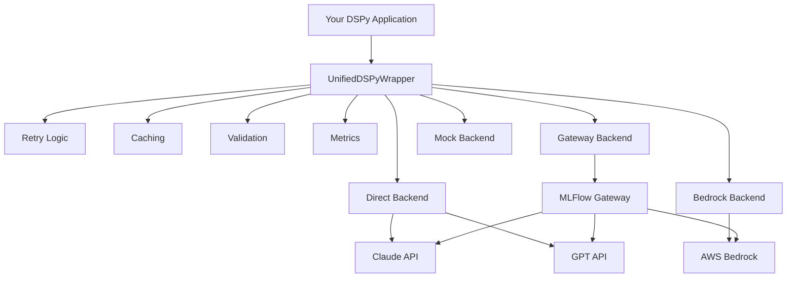
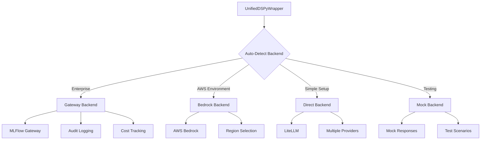
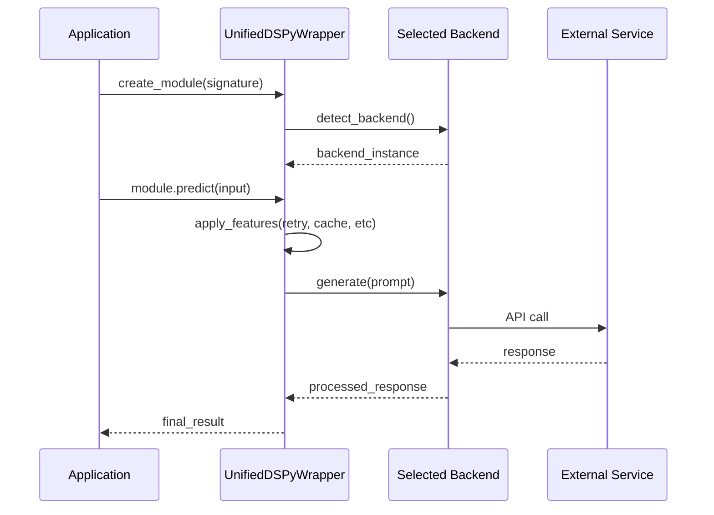
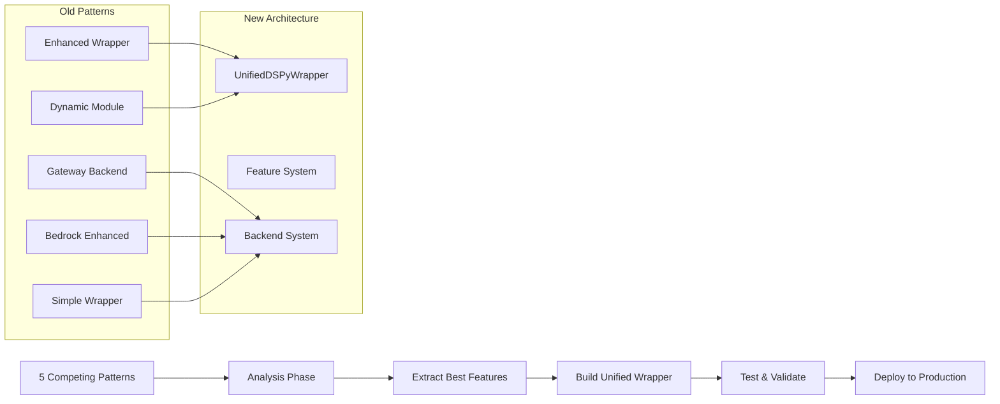

# TidyLLM Architecture - GitHub Safe Diagrams
**Repository:** github.com/rudymartin/tidyllm  
**Purpose:** GitHub-compatible diagrams for team collaboration  
**Date:** 2025-09-03

---

## Diagram 1: System Overview



**Benefits:**
- Single entry point replaces 5 competing patterns
- Pluggable backends for different environments
- Optional features with zero overhead
- Enterprise governance built-in

---

## Diagram 2: Backend Selection



**Backend Logic:**
- Gateway: Enterprise environments with governance needs
- Bedrock: AWS-native deployments with multi-region support
- Direct: Simple setups with minimal overhead
- Mock: Development and testing environments

---

## Diagram 3: Request Flow



**Flow Steps:**
1. Application creates DSPy module through wrapper
2. Wrapper auto-detects appropriate backend
3. Prediction request goes through feature pipeline
4. Backend handles external service communication
5. Response flows back with all enhancements applied

---

## Diagram 4: Migration Strategy  



**Migration Benefits:**
- 80% code reduction (5000+ lines to 1000 lines)
- Single development path
- Zero disruption during transition
- All existing features preserved

---

## Code Examples

### Basic Usage
```python
from tidyllm import UnifiedDSPyWrapper

# Auto-detect best backend
wrapper = UnifiedDSPyWrapper()
module = wrapper.create_module("question -> answer")
result = module.predict(question="What is AI?")
```

### Enterprise Configuration
```python
from tidyllm import UnifiedDSPyWrapper, UnifiedConfig, BackendType

wrapper = UnifiedDSPyWrapper(
    UnifiedConfig(
        backend=BackendType.GATEWAY,
        enable_retry=True,
        enable_cache=True,
        enable_validation=True
    )
)
```

### AWS Optimized
```python
wrapper = UnifiedDSPyWrapper(
    UnifiedConfig(backend=BackendType.BEDROCK)
)
```

### Development/Testing
```python
wrapper = UnifiedDSPyWrapper(
    UnifiedConfig(backend=BackendType.MOCK)
)
```

---

## Implementation Status

**Foundation Complete:**
- [x] Unified wrapper architecture designed
- [x] Backend system specification complete  
- [x] Feature composition system planned
- [x] Migration strategy documented

**In Development:**
- [ ] UnifiedDSPyWrapper implementation
- [ ] Backend implementations (Gateway, Bedrock, Direct, Mock)
- [ ] Feature decorators (Retry, Cache, Validation, Metrics)
- [ ] Integration testing and validation

**Next Steps:**
1. Implement core UnifiedDSPyWrapper class
2. Build pluggable backend system
3. Add feature composition layer
4. Create comprehensive tests
5. Document migration process
6. Deploy to production

---

This simplified architecture eliminates the 5 competing DSPy patterns while providing all necessary functionality through a clean, maintainable design.