# TidyLLM Architecture Diagrams
**Repository:** github.com/rudymartin/tidyllm  
**Purpose:** Shared vision alignment for collaborative development  
**Date:** 2025-09-03

---

## 📐 **Diagram 1: High-Level System Overview**
*Simple, GitHub-compatible architecture overview*

```mermaid
graph TB
    APP["🎯 Your DSPy Application"]
    DEV["👥 Development Teams"]
    
    UNIFIED["🔧 UnifiedDSPyWrapper<br/>Single Entry Point"]
    
    RETRY["🔄 Retry Logic"]
    CACHE["💾 Caching"] 
    VALID["✅ Validation"]
    METRICS["📊 Metrics"]
    
    GATEWAY["🏛️ Gateway Backend"]
    BEDROCK["☁️ Bedrock Backend"]
    DIRECT["⚡ Direct Backend"]
    MOCK["🧪 Mock Backend"]
    
    CLAUDE["🤖 Claude"]
    GPT["🧠 GPT"]
    AWS["☁️ AWS Bedrock"]
    MLFLOW["🌐 MLFlow Gateway"]
    
    APP --> UNIFIED
    DEV --> UNIFIED
    
    UNIFIED --> RETRY
    UNIFIED --> CACHE
    UNIFIED --> VALID
    UNIFIED --> METRICS
    
    UNIFIED --> GATEWAY
    UNIFIED --> BEDROCK
    UNIFIED --> DIRECT
    UNIFIED --> MOCK
    
    GATEWAY --> MLFLOW
    BEDROCK --> AWS
    DIRECT --> CLAUDE
    DIRECT --> GPT
    
    MLFLOW --> CLAUDE
    MLFLOW --> GPT
    MLFLOW --> AWS
```



### **Key Benefits:**
- **🎯 Single Entry Point**: Replace 5 competing patterns with 1 unified approach
- **🔧 Pluggable Backends**: Choose the right backend for your use case
- **⚡ Smart Features**: Optional enhancements without complexity
- **🏛️ Enterprise Ready**: Built-in governance and compliance

---

## 🔧 **Diagram 2: UnifiedDSPyWrapper Core**
*How the unified wrapper works internally*

```mermaid
graph TB
    CONFIG["📋 UnifiedConfig"]
    INIT["🏗️ Initialize Wrapper"]
    CREATE["📦 create_module()"]
    
    BACKEND_FACTORY["🏭 Backend Factory"]
    FEATURE_MANAGER["🎛️ Feature Manager"]
    
    MODULE["📋 DSPy Module"]
    PREDICT["🔮 predict() method"]
    
    GATEWAY_B["🏛️ Gateway Backend"]
    BEDROCK_B["☁️ Bedrock Backend"]
    DIRECT_B["⚡ Direct Backend"]
    MOCK_B["🧪 Mock Backend"]
    
    CONFIG --> INIT
    INIT --> CREATE
    CREATE --> BACKEND_FACTORY
    CREATE --> FEATURE_MANAGER
    CREATE --> MODULE
    
    MODULE --> PREDICT
    
    BACKEND_FACTORY --> GATEWAY_B
    BACKEND_FACTORY --> BEDROCK_B
    BACKEND_FACTORY --> DIRECT_B
    BACKEND_FACTORY --> MOCK_B
    
    FEATURE_MANAGER --> PREDICT
```



### **Implementation Pattern:**
```python
# Simple usage - replaces all 5 old patterns
from tidyllm import UnifiedDSPyWrapper

wrapper = UnifiedDSPyWrapper()  # Auto-detect best backend
module = wrapper.create_module("question -> answer")
result = module.predict(question="What is AI?")
```

---

## 🏛️ **Diagram 3: Gateway Backend Flow**
*Enterprise governance and routing*

```mermaid
graph TB
    APP["🎯 DSPy Application"]
    UNIFIED["🔧 UnifiedDSPyWrapper"]
    GATEWAY["🏛️ Gateway Backend"]
    
    AUTH["🔐 Authentication"]
    QUOTA["📊 Quota Check"]
    POLICY["📋 Policy Validation"]
    
    MLFLOW["🌐 MLFlow Gateway"]
    CLAUDE["🤖 Claude API"]
    GPT["🧠 OpenAI API"]
    AWS["☁️ AWS Bedrock"]
    
    AUDIT["📝 Audit Database"]
    COST["💰 Cost Database"]
    METRICS["📈 Metrics Database"]
    
    APP --> UNIFIED
    UNIFIED --> GATEWAY
    
    GATEWAY --> AUTH
    AUTH --> QUOTA
    QUOTA --> POLICY
    
    POLICY --> MLFLOW
    
    MLFLOW --> CLAUDE
    MLFLOW --> GPT
    MLFLOW --> AWS
    
    GATEWAY --> AUDIT
    GATEWAY --> COST
    GATEWAY --> METRICS
```



### **Enterprise Benefits:**
- **🔐 Complete Governance**: Every request authenticated and authorized
- **📊 Full Audit Trail**: Request/response logging for compliance
- **💰 Cost Management**: Real-time usage tracking and budget enforcement
- **🏛️ Policy Enforcement**: Content filtering and usage policies

---

## 📦 **Diagram 4: Migration Strategy**
*From 5 competing patterns to 1 unified approach*

```mermaid
graph TB
    subgraph "Current State"
        ENHANCED["📦 DSPyEnhancedWrapper<br/>3000+ lines"]
        GATEWAY_OLD["🏛️ DSPyGatewayBackend<br/>800+ lines"]
        BEDROCK_OLD["☁️ DSPyBedrockEnhanced<br/>2000+ lines"]
        SIMPLE["⚡ DSPyWrapper<br/>500+ lines"]
        DYNAMIC["🔄 DynamicDSPyModule<br/>50+ lines"]
    end
    
    subgraph "Migration Process"
        ANALYZE["🔍 Analyze Features"]
        EXTRACT["🏗️ Extract Best Parts"]
        IMPLEMENT["⚙️ Build Unified Wrapper"]
        VALIDATE["✅ Test & Validate"]
    end
    
    subgraph "Target State"
        UNIFIED["🔧 UnifiedDSPyWrapper<br/>1000 lines total"]
        FEATURES["🎛️ Feature System"]
        BACKENDS["🔌 Backend System"]
        COMPAT["🔄 Compatibility Layer"]
    end
    
    ENHANCED --> ANALYZE
    GATEWAY_OLD --> ANALYZE
    BEDROCK_OLD --> ANALYZE
    SIMPLE --> ANALYZE
    DYNAMIC --> ANALYZE
    
    ANALYZE --> EXTRACT
    EXTRACT --> IMPLEMENT
    IMPLEMENT --> VALIDATE
    
    VALIDATE --> UNIFIED
    UNIFIED --> FEATURES
    UNIFIED --> BACKENDS
    UNIFIED --> COMPAT
```



### **Migration Benefits:**
- **📉 80% Code Reduction**: 5000+ lines → 1000 lines
- **🔧 Single Pattern**: Clear development path
- **⚡ Zero Disruption**: Backward compatibility maintained
- **🎯 Feature Parity**: All existing features preserved

---

## 🎯 **Quick Reference Guide**

### **Basic Usage:**
```python
from tidyllm import UnifiedDSPyWrapper

# Auto-detect best backend
wrapper = UnifiedDSPyWrapper()
module = wrapper.create_module("question -> answer")
result = module.predict(question="What is AI?")
```

### **Enterprise Mode:**
```python
from tidyllm import UnifiedDSPyWrapper, UnifiedConfig, BackendType

wrapper = UnifiedDSPyWrapper(
    UnifiedConfig(
        backend=BackendType.GATEWAY,  # Enterprise routing
        enable_retry=True,
        enable_cache=True,
        enable_validation=True
    )
)
```

### **AWS Optimized:**
```python
wrapper = UnifiedDSPyWrapper(
    UnifiedConfig(backend=BackendType.BEDROCK)
)
```

### **Development/Testing:**
```python
wrapper = UnifiedDSPyWrapper(
    UnifiedConfig(backend=BackendType.MOCK)
)
```

---

**Architecture Benefits Summary:**
- 🎯 **Single unified approach** replacing 5 competing patterns
- 🔧 **Pluggable backends** for different environments
- ⚡ **Optional features** with zero overhead when unused
- 🏛️ **Enterprise governance** with full audit trails
- 📦 **Smooth migration** with backward compatibility
- 🧪 **Testing support** with mock backends

All diagrams use simplified Mermaid syntax compatible with GitHub rendering.