# TidyLLM Architecture Diagrams
**Repository:** github.com/rudymartin/tidyllm  
**Purpose:** Shared vision alignment for collaborative development  
**Date:** 2025-09-03

---

## 📐 **Diagram 1: High-Level System Overview**
*Easy-to-read general architecture for all stakeholders*

```mermaid
graph TB
    APP["🎯 Your DSPy Application"]
    DEV["👥 Development Teams"]
    
    UNIFIED["🔧 UnifiedDSPyWrapper<br/>Single Entry Point<br/>Replaces 5 Competing Patterns"]
    
    RETRY["🔄 Retry Logic"]
    CACHE["💾 Caching"]
    VALID["✅ Validation"]  
    METRICS["📊 Metrics"]
    
    GATEWAY["🏛️ Gateway Backend<br/>Enterprise Governance"]
    BEDROCK["☁️ Bedrock Backend<br/>AWS Optimized"]
    DIRECT["⚡ Direct Backend<br/>Simple & Fast"]
    MOCK["🧪 Mock Backend<br/>Testing & Dev"]
    
    CLAUDE["🤖 Claude"]
    GPT["🧠 GPT"]
    BEDROCK_SVC["☁️ AWS Bedrock"]
    MLFLOW["🌐 MLFlow Gateway"]
    
    APP --> UNIFIED
    DEV --> UNIFIED
    
    UNIFIED --> RETRY
    UNIFIED --> CACHE
    UNIFIED --> VALID
    UNIFIED --> METRICS
    
    UNIFIED --> GATEWAY
    UNIFIED --> BEDROCK
    UNIFIED --> DIRECT
    UNIFIED --> MOCK
    
    GATEWAY --> MLFLOW
    BEDROCK --> BEDROCK_SVC
    DIRECT --> CLAUDE
    DIRECT --> GPT
    
    MLFLOW --> CLAUDE
    MLFLOW --> GPT
    MLFLOW --> BEDROCK_SVC
```



### **Key Benefits Visualized:**
- **🎯 Single Entry Point**: Replace 5 competing patterns with 1 unified approach
- **🔧 Pluggable Backends**: Choose the right backend for your use case
- **⚡ Smart Features**: Optional enhancements without complexity
- **🏛️ Enterprise Ready**: Built-in governance and compliance

---

## 🔧 **Diagram 2: UnifiedDSPyWrapper Architecture**
*Detailed view of the core wrapper implementation*

```mermaid
graph TB
    subgraph "UnifiedDSPyWrapper Core"
        
        subgraph "Configuration Layer"
            CONFIG["📋 UnifiedConfig<br/>Single configuration object"]
            BACKEND_CFG["🔧 Backend Selection"]
            FEATURE_CFG["⚙️ Feature Configuration"]
        end
        
        subgraph "Wrapper Implementation"
            INIT["🏗️ __init__()<br/>Initialize wrapper with config"]
            CREATE["📦 create_module()<br/>Main factory method"]
            BACKEND_FACTORY["🏭 Backend Factory<br/>Auto-detect or explicit"]
            FEATURE_MANAGER["🎛️ Feature Manager<br/>Apply decorators"]
        end
        
        subgraph "DSPy Integration"
            MODULE["📋 DSPy Module<br/>Standard DSPy.Predict"]
            SIGNATURE["✍️ Signature<br/>Input -> Output definition"]
            PREDICT["🔮 predict()<br/>Enhanced prediction method"]
        end
        
        subgraph "Enhancement Layer"
            DECORATOR1["🔄 RetryDecorator"]
            DECORATOR2["💾 CacheDecorator"]  
            DECORATOR3["✅ ValidationDecorator"]
            DECORATOR4["📊 MetricsDecorator"]
        end
    end
    
    %% Flow
    CONFIG --> INIT
    BACKEND_CFG --> BACKEND_FACTORY
    FEATURE_CFG --> FEATURE_MANAGER
    
    INIT --> CREATE
    CREATE --> BACKEND_FACTORY
    CREATE --> FEATURE_MANAGER
    CREATE --> MODULE
    
    MODULE --> SIGNATURE
    MODULE --> PREDICT
    
    FEATURE_MANAGER --> DECORATOR1
    FEATURE_MANAGER --> DECORATOR2
    FEATURE_MANAGER --> DECORATOR3
    FEATURE_MANAGER --> DECORATOR4
    
    DECORATOR1 --> PREDICT
    DECORATOR2 --> PREDICT
    DECORATOR3 --> PREDICT
    DECORATOR4 --> PREDICT
    
    %% External connections
    USER_CODE["👨‍💻 Your Code"] --> CONFIG
    PREDICT --> BACKEND["🔌 Selected Backend"]
    
    %% Styling
    classDef config fill:#e3f2fd,stroke:#1976d2,stroke-width:2px,color:#000
    classDef wrapper fill:#f3e5f5,stroke:#7b1fa2,stroke-width:2px,color:#000
    classDef dspy fill:#e8f5e8,stroke:#388e3c,stroke-width:2px,color:#000
    classDef enhance fill:#fff3e0,stroke:#f57c00,stroke-width:2px,color:#000
    classDef external fill:#fce4ec,stroke:#c2185b,stroke-width:2px,color:#000
    
    class CONFIG,BACKEND_CFG,FEATURE_CFG config
    class INIT,CREATE,BACKEND_FACTORY,FEATURE_MANAGER wrapper
    class MODULE,SIGNATURE,PREDICT dspy
    class DECORATOR1,DECORATOR2,DECORATOR3,DECORATOR4 enhance
    class USER_CODE,BACKEND external
```



### **Implementation Philosophy:**
- **📋 Configuration-Driven**: Single config object controls everything
- **🏭 Factory Pattern**: Automatic backend selection with overrides
- **🎛️ Decorator Composition**: Features applied as composable decorators
- **🔌 Backend Abstraction**: Swappable backends without code changes

---

## 🔌 **Diagram 3: Pluggable Backend System**
*Detailed backend architecture and routing*

```mermaid
graph TB
    subgraph "Backend Selection"
        AUTO["🤖 Auto-Detection<br/>Smart backend selection"]
        EXPLICIT["👨‍💻 Explicit Selection<br/>User specifies backend"]
        FALLBACK["🛟 Fallback Chain<br/>Gateway → Bedrock → Direct → Mock"]
    end
    
    subgraph "Backend Interface"
        INTERFACE["🔌 DSPyBackend (ABC)<br/>- generate()<br/>- get_info()<br/>- health_check()"]
    end
    
    subgraph "Gateway Backend"
        GATEWAY["🏛️ GatewayBackend"]
        G_AUTH["🔐 Authentication"]
        G_ROUTE["🗺️ Route Selection"]
        G_AUDIT["📝 Audit Logging"]
        G_COST["💰 Cost Tracking"]
        G_GOVERN["🏛️ Governance Rules"]
    end
    
    subgraph "Bedrock Backend" 
        BEDROCK["☁️ BedrockBackend"]
        B_REGION["🌍 Region Selection"]
        B_MODEL["🤖 Model Selection"]
        B_AUTH["🔑 AWS Auth"]
        B_OPTIMIZE["⚡ Cost Optimization"]
    end
    
    subgraph "Direct Backend"
        DIRECT["⚡ DirectBackend"]
        D_LITELLM["📡 LiteLLM Integration"]
        D_SIMPLE["🎯 Simple Routing"]
        D_FAST["🚀 Minimal Overhead"]
    end
    
    subgraph "Mock Backend"
        MOCK["🧪 MockBackend"]
        M_PATTERNS["📝 Response Patterns"]
        M_TESTING["🧪 Test Scenarios"]
        M_DEV["👨‍💻 Development Mode"]
    end
    
    subgraph "External Services"
        MLFLOW_GW["🌐 MLFlow Gateway"]
        AWS_BEDROCK["☁️ AWS Bedrock"]
        CLAUDE_API["🤖 Claude API"]
        GPT_API["🧠 OpenAI API"]
        MOCK_RESP["📋 Mock Responses"]
    end
    
    %% Selection Flow
    AUTO --> INTERFACE
    EXPLICIT --> INTERFACE
    FALLBACK --> INTERFACE
    
    %% Backend Implementation
    INTERFACE --> GATEWAY
    INTERFACE --> BEDROCK
    INTERFACE --> DIRECT
    INTERFACE --> MOCK
    
    %% Gateway Backend Flow
    GATEWAY --> G_AUTH
    GATEWAY --> G_ROUTE
    GATEWAY --> G_AUDIT
    GATEWAY --> G_COST
    GATEWAY --> G_GOVERN
    G_ROUTE --> MLFLOW_GW
    
    %% Bedrock Backend Flow
    BEDROCK --> B_REGION
    BEDROCK --> B_MODEL
    BEDROCK --> B_AUTH
    BEDROCK --> B_OPTIMIZE
    B_MODEL --> AWS_BEDROCK
    
    %% Direct Backend Flow
    DIRECT --> D_LITELLM
    DIRECT --> D_SIMPLE
    DIRECT --> D_FAST
    D_LITELLM --> CLAUDE_API
    D_LITELLM --> GPT_API
    
    %% Mock Backend Flow
    MOCK --> M_PATTERNS
    MOCK --> M_TESTING
    MOCK --> M_DEV
    M_PATTERNS --> MOCK_RESP
    
    %% Styling
    classDef selection fill:#e1f5fe,stroke:#01579b,stroke-width:2px,color:#000
    classDef interface fill:#f3e5f5,stroke:#7b1fa2,stroke-width:3px,color:#000
    classDef gateway fill:#e8f5e8,stroke:#388e3c,stroke-width:2px,color:#000
    classDef bedrock fill:#fff3e0,stroke:#f57c00,stroke-width:2px,color:#000
    classDef direct fill:#fce4ec,stroke:#c2185b,stroke-width:2px,color:#000
    classDef mock fill:#f1f8e9,stroke:#689f38,stroke-width:2px,color:#000
    classDef external fill:#e0f2f1,stroke:#00695c,stroke-width:2px,color:#000
    
    class AUTO,EXPLICIT,FALLBACK selection
    class INTERFACE interface
    class GATEWAY,G_AUTH,G_ROUTE,G_AUDIT,G_COST,G_GOVERN gateway
    class BEDROCK,B_REGION,B_MODEL,B_AUTH,B_OPTIMIZE bedrock
    class DIRECT,D_LITELLM,D_SIMPLE,D_FAST direct
    class MOCK,M_PATTERNS,M_TESTING,M_DEV mock
    class MLFLOW_GW,AWS_BEDROCK,CLAUDE_API,GPT_API,MOCK_RESP external
```



### **Backend Selection Logic:**
```python
def auto_detect_backend():
    if gateway_available(): return BackendType.GATEWAY
    elif aws_credentials(): return BackendType.BEDROCK  
    elif production_mode(): return BackendType.DIRECT
    else: return BackendType.MOCK
```

---

## 🏛️ **Diagram 4: Gateway Routing Detailed**
*Enterprise governance and routing system*


### **Enterprise Benefits:**
- **🔐 Complete Governance**: Every request authenticated and authorized
- **📊 Full Audit Trail**: Request/response logging for compliance
- **💰 Cost Management**: Real-time usage tracking and budget enforcement
- **🏛️ Policy Enforcement**: Content filtering and usage policies

---

## 🎛️ **Diagram 5: Feature Composition System**
*How optional features enhance DSPy modules*

```mermaid
graph TB
    subgraph "Feature Configuration"
        CONFIG["📋 UnifiedConfig"]
        RETRY_CFG["🔄 RetryConfig<br/>max_retries: 3<br/>backoff: exponential"]
        CACHE_CFG["💾 CacheConfig<br/>ttl: 3600s<br/>storage: disk+memory"]
        VALID_CFG["✅ ValidationConfig<br/>min_length: 50<br/>keywords: required"]
        METRICS_CFG["📊 MetricsConfig<br/>track_performance: true<br/>export_prometheus: true"]
    end
    
    subgraph "Core DSPy Module"
        DSPY_MODULE["📋 DSPy Module<br/>dspy.Predict(signature)"]
        CORE_PREDICT["🔮 Core predict() method"]
    end
    
    subgraph "Feature Decorator Chain"
        BASE["📦 Base Module"]
        
        RETRY_DECORATOR["🔄 RetryDecorator<br/>- Exponential backoff<br/>- Failure detection<br/>- Recovery strategies"]
        
        CACHE_DECORATOR["💾 CacheDecorator<br/>- Cache key generation<br/>- TTL management<br/>- Storage optimization"]
        
        VALIDATION_DECORATOR["✅ ValidationDecorator<br/>- Response validation<br/>- Quality scoring<br/>- Custom rules"]
        
        METRICS_DECORATOR["📊 MetricsDecorator<br/>- Performance tracking<br/>- Usage analytics<br/>- Export integration"]
        
        ENHANCED_MODULE["🚀 Enhanced Module<br/>All features applied"]
    end
    
    subgraph "Feature Execution Flow"
        REQUEST["📥 Request Input"]
        
        subgraph "Pre-Processing"
            CACHE_LOOKUP["💾 Cache Lookup"]
            METRICS_START["📊 Start Metrics"]
            VALIDATE_INPUT["✅ Input Validation"]
        end
        
        subgraph "Core Processing" 
            RETRY_LOOP["🔄 Retry Loop"]
            LLM_CALL["🤖 LLM API Call"]
            RESPONSE_RAW["📨 Raw Response"]
        end
        
        subgraph "Post-Processing"
            VALIDATE_OUTPUT["✅ Output Validation"]
            CACHE_STORE["💾 Store in Cache"]
            METRICS_END["📊 Record Metrics"]
            FINAL_RESPONSE["✨ Enhanced Response"]
        end
    end
    
    %% Configuration Flow
    CONFIG --> RETRY_CFG
    CONFIG --> CACHE_CFG
    CONFIG --> VALID_CFG
    CONFIG --> METRICS_CFG
    
    %% Module Enhancement Flow
    DSPY_MODULE --> BASE
    
    RETRY_CFG --> RETRY_DECORATOR
    CACHE_CFG --> CACHE_DECORATOR
    VALID_CFG --> VALIDATION_DECORATOR
    METRICS_CFG --> METRICS_DECORATOR
    
    BASE --> RETRY_DECORATOR
    RETRY_DECORATOR --> CACHE_DECORATOR
    CACHE_DECORATOR --> VALIDATION_DECORATOR
    VALIDATION_DECORATOR --> METRICS_DECORATOR
    METRICS_DECORATOR --> ENHANCED_MODULE
    
    %% Execution Flow
    REQUEST --> ENHANCED_MODULE
    
    ENHANCED_MODULE --> CACHE_LOOKUP
    CACHE_LOOKUP --> METRICS_START
    METRICS_START --> VALIDATE_INPUT
    
    VALIDATE_INPUT --> RETRY_LOOP
    RETRY_LOOP --> LLM_CALL
    RETRY_LOOP --> CORE_PREDICT
    CORE_PREDICT --> LLM_CALL
    LLM_CALL --> RESPONSE_RAW
    
    RESPONSE_RAW --> VALIDATE_OUTPUT
    VALIDATE_OUTPUT --> CACHE_STORE
    CACHE_STORE --> METRICS_END
    METRICS_END --> FINAL_RESPONSE
    
    %% Styling
    classDef config fill:#e3f2fd,stroke:#1976d2,stroke-width:2px,color:#000
    classDef dspy fill:#e8f5e8,stroke:#388e3c,stroke-width:2px,color:#000
    classDef decorators fill:#f3e5f5,stroke:#7b1fa2,stroke-width:2px,color:#000
    classDef execution fill:#fff3e0,stroke:#f57c00,stroke-width:2px,color:#000
    classDef flow fill:#e0f2f1,stroke:#00695c,stroke-width:2px,color:#000
    
    class CONFIG,RETRY_CFG,CACHE_CFG,VALID_CFG,METRICS_CFG config
    class DSPY_MODULE,CORE_PREDICT dspy
    class BASE,RETRY_DECORATOR,CACHE_DECORATOR,VALIDATION_DECORATOR,METRICS_DECORATOR,ENHANCED_MODULE decorators
    class REQUEST,FINAL_RESPONSE execution
    class CACHE_LOOKUP,METRICS_START,VALIDATE_INPUT,RETRY_LOOP,LLM_CALL,RESPONSE_RAW,VALIDATE_OUTPUT,CACHE_STORE,METRICS_END flow
```



### **Decorator Pattern Benefits:**
- **🔧 Composable**: Mix and match features as needed
- **⚡ Optional**: Zero overhead for unused features
- **🎯 Focused**: Each decorator has single responsibility
- **🔄 Stackable**: Apply multiple enhancements in order

---

## 📦 **Diagram 6: Migration Strategy**
*From 5 competing patterns to 1 unified approach*

```mermaid
graph TB
    subgraph "Current State - 5 Competing Patterns"
        ENHANCED["📦 DSPyEnhancedWrapper<br/>3000+ lines<br/>Most feature-complete"]
        GATEWAY_OLD["🏛️ DSPyGatewayBackend<br/>800+ lines<br/>MLFlow routing"]
        BEDROCK_OLD["☁️ DSPyBedrockEnhanced<br/>2000+ lines<br/>70% duplicate of Enhanced"]
        SIMPLE["⚡ DSPyWrapper<br/>500+ lines<br/>Basic features only"]
        DYNAMIC["🔄 DynamicDSPyModule<br/>50+ lines<br/>No enterprise features"]
    end
    
    subgraph "Migration Process"
        ANALYZE["🔍 Analysis Phase<br/>- Map features<br/>- Identify duplicates<br/>- Test compatibility"]
        
        EXTRACT["🏗️ Extraction Phase<br/>- Extract best features<br/>- Create unified interface<br/>- Build backend system"]
        
        IMPLEMENT["⚙️ Implementation Phase<br/>- UnifiedDSPyWrapper<br/>- Pluggable backends<br/>- Feature decorators"]
        
        VALIDATE["✅ Validation Phase<br/>- Backward compatibility<br/>- Performance testing<br/>- Feature parity"]
    end
    
    subgraph "Target State - Unified Architecture"
        subgraph "Single Wrapper"
            UNIFIED["🔧 UnifiedDSPyWrapper<br/>1000 lines total<br/>All features available"]
        end
        
        subgraph "Extracted Features"
            RETRY_FEAT["🔄 RetryManager<br/>From Enhanced"]
            CACHE_FEAT["💾 CacheManager<br/>From Enhanced + Simple"]
            VALID_FEAT["✅ ValidationManager<br/>From Enhanced"]
            METRICS_FEAT["📊 MetricsManager<br/>From Enhanced + Gateway"]
        end
        
        subgraph "Backend System"
            GATEWAY_BACKEND["🏛️ GatewayBackend<br/>From DSPyGatewayBackend"]
            BEDROCK_BACKEND["☁️ BedrockBackend<br/>From DSPyBedrockEnhanced"]
            DIRECT_BACKEND["⚡ DirectBackend<br/>From DSPyWrapper"]
            MOCK_BACKEND["🧪 MockBackend<br/>New for testing"]
        end
        
        subgraph "Compatibility Layer"
            COMPAT["🔄 Backward Compatibility<br/>Old imports still work<br/>Gradual migration support"]
        end
    end
    
    subgraph "Migration Timeline"
        WEEK1["📅 Week 1<br/>Foundation<br/>- Create UnifiedDSPyWrapper<br/>- Basic backend system"]
        WEEK2["📅 Week 2<br/>Features<br/>- Feature decorators<br/>- Compatibility layer"]
        WEEK3["📅 Week 3<br/>Testing<br/>- Comprehensive tests<br/>- Performance validation"]
        WEEK4["📅 Week 4<br/>Migration<br/>- Update imports<br/>- Remove old patterns"]
    end
    
    %% Current State Flow
    ENHANCED --> ANALYZE
    GATEWAY_OLD --> ANALYZE
    BEDROCK_OLD --> ANALYZE
    SIMPLE --> ANALYZE
    DYNAMIC --> ANALYZE
    
    %% Migration Process Flow
    ANALYZE --> EXTRACT
    EXTRACT --> IMPLEMENT
    IMPLEMENT --> VALIDATE
    
    %% Target State Flow
    VALIDATE --> UNIFIED
    
    ENHANCED --> RETRY_FEAT
    ENHANCED --> CACHE_FEAT
    ENHANCED --> VALID_FEAT
    ENHANCED --> METRICS_FEAT
    
    GATEWAY_OLD --> GATEWAY_BACKEND
    GATEWAY_OLD --> METRICS_FEAT
    
    BEDROCK_OLD --> BEDROCK_BACKEND
    
    SIMPLE --> DIRECT_BACKEND
    SIMPLE --> CACHE_FEAT
    
    DYNAMIC --> UNIFIED
    
    UNIFIED --> COMPAT
    
    %% Timeline Flow
    WEEK1 --> WEEK2
    WEEK2 --> WEEK3
    WEEK3 --> WEEK4
    
    IMPLEMENT --> WEEK1
    VALIDATE --> WEEK3
    
    %% Styling
    classDef current fill:#ffebee,stroke:#d32f2f,stroke-width:2px,color:#000
    classDef process fill:#e3f2fd,stroke:#1976d2,stroke-width:2px,color:#000
    classDef unified fill:#f3e5f5,stroke:#7b1fa2,stroke-width:3px,color:#000
    classDef features fill:#e8f5e8,stroke:#388e3c,stroke-width:2px,color:#000
    classDef backends fill:#fff3e0,stroke:#f57c00,stroke-width:2px,color:#000
    classDef compat fill:#f1f8e9,stroke:#689f38,stroke-width:2px,color:#000
    classDef timeline fill:#fce4ec,stroke:#c2185b,stroke-width:2px,color:#000
    
    class ENHANCED,GATEWAY_OLD,BEDROCK_OLD,SIMPLE,DYNAMIC current
    class ANALYZE,EXTRACT,IMPLEMENT,VALIDATE process
    class UNIFIED unified
    class RETRY_FEAT,CACHE_FEAT,VALID_FEAT,METRICS_FEAT features
    class GATEWAY_BACKEND,BEDROCK_BACKEND,DIRECT_BACKEND,MOCK_BACKEND backends
    class COMPAT compat
    class WEEK1,WEEK2,WEEK3,WEEK4 timeline
```



### **Migration Benefits:**
- **📉 80% Code Reduction**: 5000+ lines → 1000 lines
- **🔧 Single Pattern**: Clear development path
- **⚡ Zero Disruption**: Backward compatibility maintained
- **🎯 Feature Parity**: All existing features preserved

---

## 🎯 **Quick Reference Guide**

### **For Developers:**
```python
# Simple usage (replaces all 5 old patterns)
from tidyllm import UnifiedDSPyWrapper

# Auto-detect best backend
wrapper = UnifiedDSPyWrapper()

# Create enhanced module  
module = wrapper.create_module("question -> answer")

# Use like normal DSPy
result = module.predict(question="What is AI?")
```

### **For Enterprise Teams:**
```python
# Enterprise governance mode
wrapper = UnifiedDSPyWrapper(
    UnifiedConfig(
        backend=BackendType.GATEWAY,  # Enterprise routing
        retry=RetryConfig(max_retries=3),
        cache=CacheConfig(ttl_seconds=3600),
        validation=ValidationConfig(min_length=50)
    )
)
```

### **For AWS Teams:**
```python
# AWS optimized mode
wrapper = UnifiedDSPyWrapper(
    UnifiedConfig(backend=BackendType.BEDROCK)
)
```

### **For Development/Testing:**
```python
# Mock mode for development
wrapper = UnifiedDSPyWrapper(
    UnifiedConfig(backend=BackendType.MOCK)
)
```

---

## 📝 **Editable Mermaid Code**

All diagrams above are provided as editable Mermaid code for easy updates in GitHub. To edit:

1. Copy the mermaid code block
2. Paste into GitHub markdown or Mermaid Live Editor
3. Make changes
4. Update this documentation

This ensures all teams maintain shared visual understanding as the architecture evolves.

---

**These diagrams provide shared vision alignment for:**
- 🎯 **High-level system overview** - What we're building
- 🔧 **Implementation details** - How we're building it  
- 🏛️ **Enterprise integration** - Why it matters for business
- 📦 **Migration strategy** - How we get there safely

All teams now have the same visual reference for discussions and development.