# Triple Gateway Architecture Proposal for DSPy Team
## HeirOSGateway + LLMPromptGateway + LLMGateway

**Proposal Date:** 2025-09-03  
**Target Audience:** DSPy Development Team  
**Status:** Architecture Proposal for Review

---

## 📊 **Architecture Overview Diagram**

```mermaid
graph TB
    %% Application Layer
    subgraph "Application Layer"
        APP[["🎯 Your Application<br/>(DSPy Programs, Business Logic)"]]
    end
    
    %% Optional Gateway Layer 1 - Workflow Intelligence
    subgraph "Layer 1: Workflow Intelligence (OPTIONAL)"
        HEIROS["🔄 HeirOSGateway<br/>• Hierarchical DAG Management<br/>• SPARSE Agreements<br/>• Workflow Optimization<br/>• Process Analytics"]
        
        subgraph "HeirOS Components"
            DAG["📊 DAG Manager"]
            SPARSE["📋 SPARSE Agreements"] 
            OPT["⚡ Workflow Optimizer"]
        end
        
        HEIROS --> DAG
        HEIROS --> SPARSE
        HEIROS --> OPT
    end
    
    %% Optional Gateway Layer 2 - Prompt Intelligence  
    subgraph "Layer 2: Prompt Intelligence (OPTIONAL)"
        PROMPT["💡 LLMPromptGateway<br/>• Prompt Enhancement<br/>• Content Filtering<br/>• A/B Testing<br/>• Caching & Optimization"]
        
        subgraph "Prompt Components"
            ENHANCE["✨ Prompt Enhancer"]
            FILTER["🛡️ Content Filter"]
            CACHE["💾 Prompt Cache"]
        end
        
        PROMPT --> ENHANCE
        PROMPT --> FILTER  
        PROMPT --> CACHE
    end
    
    %% Mandatory Gateway Layer - Enterprise Governance
    subgraph "Layer 3: Enterprise Governance (MANDATORY)"
        LLM["🏛️ LLMGateway<br/>• IT Controls & Governance<br/>• Cost Tracking & Budgets<br/>• Audit Trails<br/>• Security & Compliance"]
        
        subgraph "Governance Components"
            AUDIT["📝 Audit Logger"]
            COST["💰 Cost Tracker"]
            SEC["🔒 Security Controls"]
            POLICY["📊 Policy Engine"]
        end
        
        LLM --> AUDIT
        LLM --> COST
        LLM --> SEC
        LLM --> POLICY
    end
    
    %% MLFlow Gateway Layer
    subgraph "Corporate Infrastructure"
        MLFLOW["🌐 MLFlow Gateway<br/>• Provider Routing<br/>• Load Balancing<br/>• Corporate IT Controls"]
    end
    
    %% External Providers
    subgraph "External AI Providers"
        CLAUDE["🤖 Claude<br/>(Anthropic)"]
        GPT["🧠 GPT<br/>(OpenAI)"]
        BEDROCK["☁️ Bedrock<br/>(AWS)"]
        OTHER["... Other<br/>Providers"]
    end
    
    %% Flow Connections
    APP --> HEIROS
    APP --> PROMPT  
    APP --> LLM
    
    HEIROS --> PROMPT
    HEIROS --> LLM
    PROMPT --> LLM
    
    LLM --> MLFLOW
    
    MLFLOW --> CLAUDE
    MLFLOW --> GPT
    MLFLOW --> BEDROCK
    MLFLOW --> OTHER
    
    %% Usage Pattern Labels
    APP -.->|"Pattern 1: Full Stack"| HEIROS
    APP -.->|"Pattern 2: Enhanced Prompts"| PROMPT
    APP -.->|"Pattern 3: Direct Governance"| LLM
    
    %% Styling
    classDef optional fill:#e1f5fe,stroke:#01579b,stroke-width:2px,color:#000
    classDef mandatory fill:#ffebee,stroke:#c62828,stroke-width:3px,color:#000
    classDef infrastructure fill:#f3e5f5,stroke:#4a148c,stroke-width:2px,color:#000
    classDef providers fill:#e8f5e8,stroke:#2e7d32,stroke-width:2px,color:#000
    classDef components fill:#fff3e0,stroke:#ef6c00,stroke-width:1px,color:#000
    
    class HEIROS,PROMPT optional
    class LLM mandatory
    class MLFLOW infrastructure
    class CLAUDE,GPT,BEDROCK,OTHER providers
    class DAG,SPARSE,OPT,ENHANCE,FILTER,CACHE,AUDIT,COST,SEC,POLICY components
```



### **Legend:**
- 🔵 **Blue (Optional):** HeirOSGateway & LLMPromptGateway - Can be bypassed
- 🔴 **Red (Mandatory):** LLMGateway - Cannot be bypassed, all requests must flow through
- 🟣 **Purple (Infrastructure):** Corporate MLFlow Gateway - IT managed
- 🟢 **Green (Providers):** External AI services - Claude, GPT, Bedrock, etc.

---

## 🏗️ **Proposed Three-Gateway Architecture**

### **The Vision: Graduated AI Intelligence Stack**

```
[Application] 
    ↓ (optional)
[HeirOSGateway] ← Workflow design, SPARSE agreements, DAG management
    ↓ (optional)
[LLMPromptGateway] ← Prompt optimization, content filtering
    ↓ (mandatory)
[LLMGateway] ← Enterprise governance, audit, cost control
    ↓
[MLFlow Gateway → External Providers]
```

### **Layer Overview:**
- **Layer 1: HeirOSGateway (OPTIONAL)** - *Workflow Intelligence*
- **Layer 2: LLMPromptGateway (OPTIONAL)** - *Prompt Intelligence*  
- **Layer 3: LLMGateway (MANDATORY)** - *Enterprise Governance*

---

## 🎯 **Gateway Responsibilities & Value Proposition**

### **1. HeirOSGateway - Workflow Orchestration Layer**

**Purpose:** Advanced workflow design, orchestration, and AI-powered process optimization

**Core Features:**
- **Hierarchical DAG Management:** Complex multi-step workflows with tree-based structure
- **SPARSE Agreement Integration:** Pre-approved decisions with compliance tracking
- **Dynamic Flow Generation:** AI creates optimal workflow paths based on context
- **Performance Analytics:** Continuous workflow improvement through execution data
- **Resource Allocation:** Smart scheduling and load balancing for workflow execution

**Key Classes:**
```python
@dataclass
class HeirOSGatewayConfig:
    enable_workflow_optimization: bool = True
    enable_sparse_agreements: bool = True
    enable_dynamic_flows: bool = True
    compliance_level: ComplianceLevel = ComplianceLevel.FULL_TRANSPARENCY

class HeirOSGateway:
    """Optional workflow orchestration and optimization layer"""
    
    def create_workflow(self, name: str, complexity: str = "auto"):
        """AI-powered workflow design"""
        
    def optimize_workflow(self, workflow_id: str, performance_data: dict):
        """Continuous workflow optimization"""
        
    def execute_hierarchical_dag(self, workflow_id: str, context: dict):
        """Execute complex multi-step workflows with LLM integration"""
        
    def create_sparse_decision_node(
        self,
        agreement_id: str,
        conditions: List[str],
        pre_approved_actions: List[dict]
    ) -> SparseDecisionNode:
        """Create pre-approved decision nodes for compliance workflows"""
```

**When to Use:**
- ✅ Complex multi-step business processes
- ✅ Regulatory compliance workflows requiring pre-approved decisions
- ✅ Research pipelines with multiple analysis phases
- ✅ Process optimization and continuous improvement scenarios
- ❌ Simple single-shot AI interactions

---

### **2. LLMPromptGateway - Prompt Enhancement Layer**

**Purpose:** Prompt engineering, content filtering, and optimization before LLM execution

**Core Features:**
- **Prompt Engineering:** Templates, few-shot examples, context injection
- **Content Filtering:** PII detection, inappropriate content screening
- **Prompt Optimization:** Compression, quality scoring, A/B testing
- **Caching:** Intelligent caching of enhanced prompts and responses
- **Strategy Selection:** Auto-selection of optimal prompt enhancement strategies

**Key Classes:**
```python
@dataclass 
class PromptGatewayConfig:
    enable_enhancement: bool = True
    enable_content_filtering: bool = True
    enable_prompt_caching: bool = True
    enhancement_strategies: List[str] = field(default_factory=lambda: ["few-shot", "chain-of-thought"])

class LLMPromptGateway:
    """Optional prompt enhancement layer before mandatory LLM Gateway"""
    
    def __init__(self, llm_gateway: LLMGateway):
        self.llm_gateway = llm_gateway  # MUST have mandatory gateway
        self.prompt_enhancer = PromptEnhancer()
        self.content_filter = ContentFilter()
    
    def enhance_and_chat(self, messages, enhancement_strategy="auto", **kwargs):
        # Optional enhancement
        enhanced = self.prompt_enhancer.enhance(messages, strategy)
        filtered = self.content_filter.filter(enhanced)
        
        # Mandatory gateway call
        return self.llm_gateway.chat(filtered, **kwargs)
        
    def chat_with_enhancement(self, messages, strategy=None, **llm_kwargs):
        """Enhanced chat with optional prompt optimization"""
        if self.config.enable_enhancement and strategy:
            messages = self.enhance_prompt(messages, strategy)
        
        if self.config.enable_content_filtering:
            messages = self.filter_content(messages)
            
        # ALWAYS goes through mandatory gateway
        return self.llm_gateway.chat(messages, **llm_kwargs)
```

**When to Use:**
- ✅ Applications requiring consistent prompt quality
- ✅ Content-sensitive environments needing filtering
- ✅ A/B testing different prompt approaches
- ✅ Performance optimization through prompt engineering
- ❌ Basic operations where prompt enhancement adds no value

---

### **3. LLMGateway - Enterprise Governance Layer (MANDATORY)**

**Purpose:** Enterprise control point - ALL LLM requests MUST go through this layer

**Core Features:**
- **IT Governance:** Provider whitelisting, model availability controls
- **Cost Controls:** Budget limits, per-request cost limits, spending tracking
- **Audit Trails:** Complete request/response logging for compliance
- **Security Controls:** No direct external API access, centralized authentication
- **Quality Controls:** Temperature limits, token limits, content validation

**Existing Implementation Highlights:**
```python
class LLMGatewayConfig(GatewayConfig):
    # MLFlow Gateway settings
    mlflow_gateway_uri: str = "http://localhost:5000"
    
    # Provider controls (IT managed)
    available_providers: List[str] = None
    default_provider: str = "claude"
    
    # Cost controls
    max_tokens_per_request: int = 4096
    max_cost_per_request_usd: float = 1.0
    budget_limit_daily_usd: Optional[float] = None
    
    # Quality controls
    temperature_limits: tuple = (0.0, 1.0)
    require_audit_reason: bool = True

class LLMGateway(BaseGateway):
    """Corporate LLM Gateway - Centralized language model access"""
    
    def chat(
        self, 
        messages: List[Dict[str, str]], 
        user_id: str,
        provider: Optional[str] = None,
        model: Optional[str] = None,
        temperature: float = 0.1,
        max_tokens: int = 1000,
        audit_reason: Optional[str] = None,
        **kwargs
    ) -> GatewayResponse:
        """Chat completion through corporate gateway with full governance"""
```

**Architecture:** `Application → LLMGateway → MLFlow Gateway → Corporate IT → External Provider`

**Non-Negotiable:** This layer cannot be bypassed - all LLM operations must flow through it.

---

## 🔄 **Integration Patterns & Usage Examples**

### **Pattern 1: Full Stack (All Three Gateways)**
```python
# Enterprise AI workflow with full intelligence stack
workflow = heiros_gateway.create_compliance_workflow(
    name="Document Analysis Pipeline",
    regulatory_framework="SOX_COMPLIANCE"
)

# Workflow orchestrates multiple LLM calls
result = heiros_gateway.execute_workflow(
    workflow_id="doc_pipeline_001",
    context={"document": doc, "user_id": "analyst_123"},
    prompt_gateway=prompt_gateway,  # Optional prompt enhancement
    llm_gateway=llm_gateway        # Mandatory governance
)
```

### **Pattern 2: Prompt Enhancement + Governance (Skip Workflow)**
```python
# Enhanced prompts without complex workflow orchestration
response = prompt_gateway.chat_enhanced(
    messages=[{"role": "user", "content": "Analyze this financial report..."}],
    strategy="few-shot",
    user_id="analyst_456",
    audit_reason="Financial analysis review"
)
```

### **Pattern 3: Direct Governance (Minimal Path)**
```python
# Simple operations bypass all optional layers
response = llm_gateway.chat(
    messages=[{"role": "user", "content": "What is 2+2?"}],
    user_id="dev123",
    audit_reason="Simple calculation"
)
```

### **Pattern 4: Workflow + Governance (Skip Prompt Enhancement)**
```python
# Complex workflows without prompt optimization
workflow_result = heiros_gateway.execute_workflow(
    workflow_id="compliance_check_workflow",
    context={"document_id": "doc_789"},
    llm_gateway=llm_gateway  # Direct to governance
)
```

---

## 🚦 **Usage Decision Matrix**

| Use Case | HeirOS Gateway | Prompt Gateway | LLM Gateway | Rationale |
|----------|---------------|---------------|-------------|-----------|
| Simple Q&A chat | ❌ | ❌ | ✅ | Direct path for basic operations |
| Enhanced prompts | ❌ | ✅ | ✅ | Prompt optimization adds value |
| Complex workflows | ✅ | ✅ | ✅ | Full intelligence stack needed |
| Compliance processes | ✅ | ❌ | ✅ | SPARSE agreements + governance |
| Research pipelines | ✅ | ✅ | ✅ | Multi-step analysis with optimization |
| Creative writing | ❌ | ✅ | ✅ | Prompt enhancement without workflow |
| Batch processing | ✅ | ❌ | ✅ | Workflow orchestration + governance |
| Emergency operations | ❌ | ❌ | ✅ | Minimal latency, maximum reliability |

---

## ⚡ **Implementation Architecture**

### **Core Integration Pattern:**
```python
class EnterpriseAIOrchestrator:
    """Main orchestration class integrating all three gateways"""
    
    def __init__(
        self,
        llm_gateway: LLMGateway,                    # MANDATORY
        prompt_gateway: LLMPromptGateway = None,    # OPTIONAL
        heiros_gateway: HeirOSGateway = None        # OPTIONAL
    ):
        # LLM Gateway is always required
        self.llm_gateway = llm_gateway
        
        # Optional layers
        self.prompt_gateway = prompt_gateway
        self.heiros_gateway = heiros_gateway
        
        # Wire optional layers to mandatory gateway
        if self.prompt_gateway:
            self.prompt_gateway.llm_gateway = llm_gateway
            
        if self.heiros_gateway:
            self.heiros_gateway.llm_gateway = llm_gateway
            self.heiros_gateway.prompt_gateway = prompt_gateway
    
    def execute_ai_operation(
        self,
        operation_type: str,
        context: dict,
        **kwargs
    ):
        """Route AI operations through appropriate gateway stack"""
        
        if operation_type == "workflow" and self.heiros_gateway:
            return self.heiros_gateway.execute_workflow(context, **kwargs)
            
        elif operation_type == "enhanced_chat" and self.prompt_gateway:
            return self.prompt_gateway.chat_enhanced(context, **kwargs)
            
        else:
            # Fall back to direct LLM gateway
            return self.llm_gateway.chat(context, **kwargs)
```

### **Configuration Strategy:**
```python
# Different deployment configurations
class DeploymentConfigs:
    
    @staticmethod
    def minimal_deployment():
        """Just mandatory governance"""
        return EnterpriseAIOrchestrator(
            llm_gateway=LLMGateway(config)
        )
    
    @staticmethod  
    def enhanced_deployment():
        """Governance + prompt enhancement"""
        return EnterpriseAIOrchestrator(
            llm_gateway=LLMGateway(config),
            prompt_gateway=LLMPromptGateway(config)
        )
    
    @staticmethod
    def full_deployment():
        """Complete intelligence stack"""
        return EnterpriseAIOrchestrator(
            llm_gateway=LLMGateway(config),
            prompt_gateway=LLMPromptGateway(config),
            heiros_gateway=HeirOSGateway(config)
        )
```

---

## 🎯 **Business Value Proposition**

### **For Enterprise Teams:**
- **Graduated Complexity:** Choose sophistication level based on needs
- **Risk Management:** Mandatory governance with optional intelligence enhancements
- **Process Automation:** Complex workflows with AI decision points
- **Regulatory Compliance:** SPARSE agreements ensure pre-approved decisions
- **Cost Optimization:** Intelligent routing and caching reduce LLM costs
- **Innovation Safe Space:** Experiment with advanced AI without compromising controls

### **For Development Teams:**
- **Flexible Architecture:** Start simple, add complexity as needed
- **Clear Separation of Concerns:** Each gateway has distinct responsibilities
- **Reusable Patterns:** Share workflow templates and prompt strategies
- **Progressive Enhancement:** Incremental adoption of advanced features
- **Debugging Clarity:** Clear layer boundaries for troubleshooting
- **Performance Optimization:** Caching and optimization at appropriate layers

### **For IT/Compliance Teams:**
- **Non-Bypassable Controls:** Mandatory governance layer cannot be circumvented
- **Complete Audit Trails:** Full visibility into all AI operations
- **Cost Management:** Centralized budget controls and spending tracking
- **Security Assurance:** No direct external API access, centralized authentication
- **Compliance Framework:** SPARSE agreements for regulated processes

---

## 🚀 **Implementation Roadmap**

### **Phase 1: Foundation (Weeks 1-4)**
**Objective:** Establish mandatory governance layer
- [ ] **Consolidate LLMGateway implementations** (resolve 4 competing versions)
- [ ] **Fix LM backend configuration** (resolve "No LM is loaded" errors)
- [ ] **Complete MLFlow Gateway integration** (fix import issues)
- [ ] **Establish core governance features** (cost tracking, audit trails)
- [ ] **Create comprehensive test suite** for LLMGateway

### **Phase 2: Enhancement Layer (Weeks 5-8)**
**Objective:** Add optional prompt intelligence
- [ ] **Design and implement LLMPromptGateway** 
- [ ] **Build prompt enhancement strategies** (few-shot, chain-of-thought, etc.)
- [ ] **Implement content filtering** (PII detection, safety checks)
- [ ] **Add prompt caching layer** (performance optimization)
- [ ] **Create prompt A/B testing framework**
- [ ] **Integration testing** with LLMGateway

### **Phase 3: Workflow Intelligence (Weeks 9-16)**
**Objective:** Add optional workflow orchestration
- [ ] **Integrate existing HeirOS DAG system** with gateway architecture
- [ ] **Implement HeirOSGateway class** with workflow orchestration
- [ ] **Build SPARSE agreement integration** for compliance workflows
- [ ] **Create workflow optimization engine** (AI-powered process improvement)
- [ ] **Develop workflow template library** (reusable patterns)
- [ ] **End-to-end integration testing** with all three gateways

### **Phase 4: Enterprise Readiness (Weeks 17-20)**
**Objective:** Production deployment preparation
- [ ] **Performance optimization** and load testing
- [ ] **Security audit** and penetration testing
- [ ] **Documentation completion** (technical and user guides)
- [ ] **Training material creation** for different user personas
- [ ] **Migration toolkit** for existing applications
- [ ] **Production deployment guides**

---

## ⚠️ **Critical Design Decisions for DSPy Team**

### **Decision Point 1: Gateway Dependency Model**
**Question:** Should optional gateways be able to function independently?

**Option A (Recommended):** Strict dependency chain
- LLMPromptGateway REQUIRES LLMGateway
- HeirOSGateway REQUIRES LLMGateway (and optionally LLMPromptGateway)
- **Pros:** Simple integration, guaranteed governance
- **Cons:** Less flexibility for specialized use cases

**Option B:** Independent operation with adapters
- Each gateway can work independently
- Adapter pattern connects gateways when needed
- **Pros:** Maximum flexibility, easier testing
- **Cons:** Complex configuration, potential governance bypass

### **Decision Point 2: Configuration Strategy**
**Question:** How should teams configure their gateway stack?

**Option A (Recommended):** Deployment profiles
```python
# Pre-defined configurations for common use cases
orchestrator = EnterpriseAIOrchestrator.from_profile("full_stack")
```

**Option B:** Component-by-component configuration
```python
# Manual wiring of each component
orchestrator = EnterpriseAIOrchestrator(
    llm_gateway=LLMGateway(llm_config),
    prompt_gateway=LLMPromptGateway(prompt_config),
    heiros_gateway=HeirOSGateway(workflow_config)
)
```

### **Decision Point 3: Error Handling Strategy**
**Question:** How should failures in optional layers be handled?

**Option A (Recommended):** Graceful degradation
- If HeirOSGateway fails → fall back to LLMPromptGateway
- If LLMPromptGateway fails → fall back to LLMGateway
- Always preserve mandatory governance

**Option B:** Fail-fast approach
- Any configured gateway failure stops the entire operation
- Forces explicit handling of each layer's errors

### **Decision Point 4: Performance vs. Features Trade-off**
**Question:** Should there be a "performance mode" that bypasses optional layers?

**Option A:** Performance mode available
- Emergency/high-performance operations can skip optional layers
- Configuration flag enables direct-to-LLMGateway routing

**Option B (Recommended):** No bypass options
- All configured layers must be traversed
- Performance optimizations happen within each layer

---

## 🔍 **Questions for DSPy Team**

### **Architecture Questions:**
1. **Does this three-layer architecture align with DSPy's vision for enterprise AI?**
2. **Are there conflicts between this gateway pattern and DSPy's compilation/optimization approach?**
3. **Should DSPy programs be executed within workflows (HeirOSGateway) or at the prompt layer?**

### **Integration Questions:**
4. **How should DSPy's caching interact with prompt-level caching?**
5. **Can DSPy programs be treated as "workflow nodes" in the HeirOS DAG system?**
6. **Should DSPy optimization happen at the prompt gateway level or within workflows?**

### **Implementation Questions:**
7. **What's the preferred approach for handling the 4 competing DSPy implementations discovered?**
8. **Should there be DSPy-specific gateway methods (e.g., `execute_dspy_program()`) or generic interfaces?**
9. **How important is backward compatibility with existing DSPy code patterns?**

### **Deployment Questions:**
10. **Which deployment profile would be most valuable for DSPy users initially?**
11. **Should there be DSPy-specific deployment profiles (e.g., "research_workflow", "production_inference")?**
12. **What level of configuration complexity is acceptable for DSPy developers?**

---

## 📝 **Next Steps**

### **For DSPy Team Review:**
1. **Architectural Alignment:** Review proposed architecture against DSPy roadmap
2. **Feature Prioritization:** Identify which gateway features are most valuable
3. **Integration Strategy:** Determine how DSPy compilation fits with gateway layers
4. **Implementation Planning:** Decide on implementation approach and timeline

### **After DSPy Team Feedback:**
1. **Architecture Refinement:** Incorporate feedback into design
2. **Detailed Technical Specification:** Create implementation-ready specifications
3. **Proof of Concept:** Build minimal working version of chosen approach
4. **Migration Planning:** Plan transition from current competing implementations

---

**This proposal represents a comprehensive enterprise AI architecture that maintains mandatory governance while enabling optional intelligence enhancements. The goal is to provide DSPy teams with a flexible, scalable foundation for building sophisticated AI applications within enterprise constraints.**