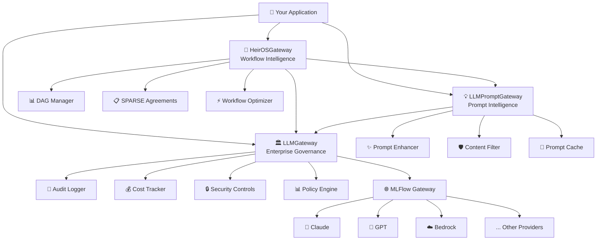

```mermaid
graph TB
    APP["🎯 Your Application"]
    
    HEIROS["🔄 HeirOSGateway<br/>Workflow Intelligence"]
    PROMPT["💡 LLMPromptGateway<br/>Prompt Intelligence"]
    LLM["🏛️ LLMGateway<br/>Enterprise Governance"]
    
    DAG["📊 DAG Manager"]
    SPARSE["📋 SPARSE Agreements"]
    OPT["⚡ Workflow Optimizer"]
    
    ENHANCE["✨ Prompt Enhancer"]
    FILTER["🛡️ Content Filter"]
    CACHE["💾 Prompt Cache"]
    
    AUDIT["📝 Audit Logger"]
    COST["💰 Cost Tracker"]
    SEC["🔒 Security Controls"]
    POLICY["📊 Policy Engine"]
    
    MLFLOW["🌐 MLFlow Gateway"]
    
    CLAUDE["🤖 Claude"]
    GPT["🧠 GPT"]
    BEDROCK["☁️ Bedrock"]
    OTHER["... Other Providers"]
    
    APP --> HEIROS
    APP --> PROMPT
    APP --> LLM
    
    HEIROS --> DAG
    HEIROS --> SPARSE
    HEIROS --> OPT
    
    PROMPT --> ENHANCE
    PROMPT --> FILTER
    PROMPT --> CACHE
    
    LLM --> AUDIT
    LLM --> COST
    LLM --> SEC
    LLM --> POLICY
    
    HEIROS --> PROMPT
    HEIROS --> LLM
    PROMPT --> LLM
    
    LLM --> MLFLOW
    
    MLFLOW --> CLAUDE
    MLFLOW --> GPT
    MLFLOW --> BEDROCK
    MLFLOW --> OTHER
```