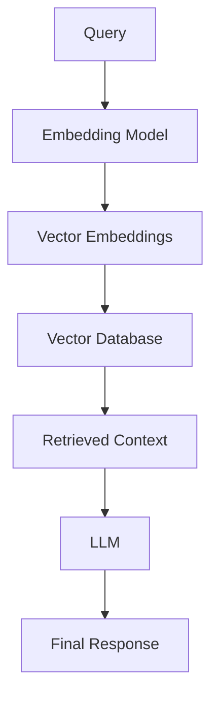
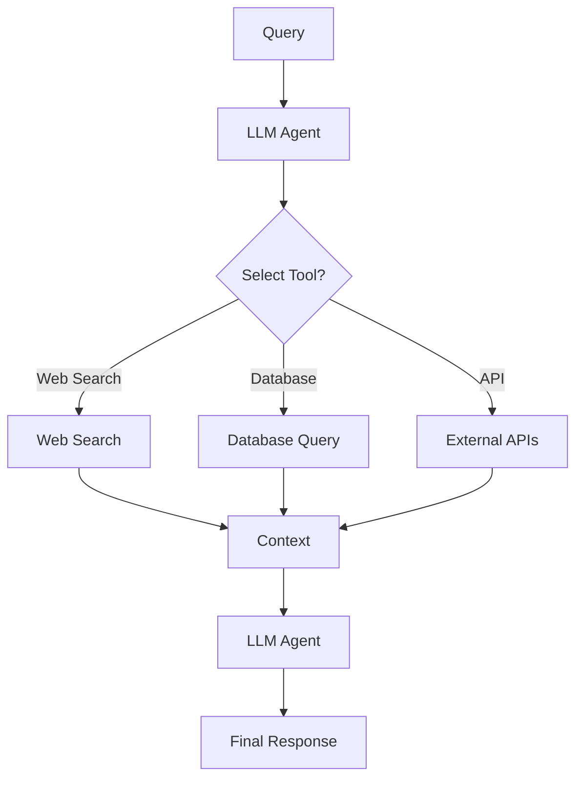
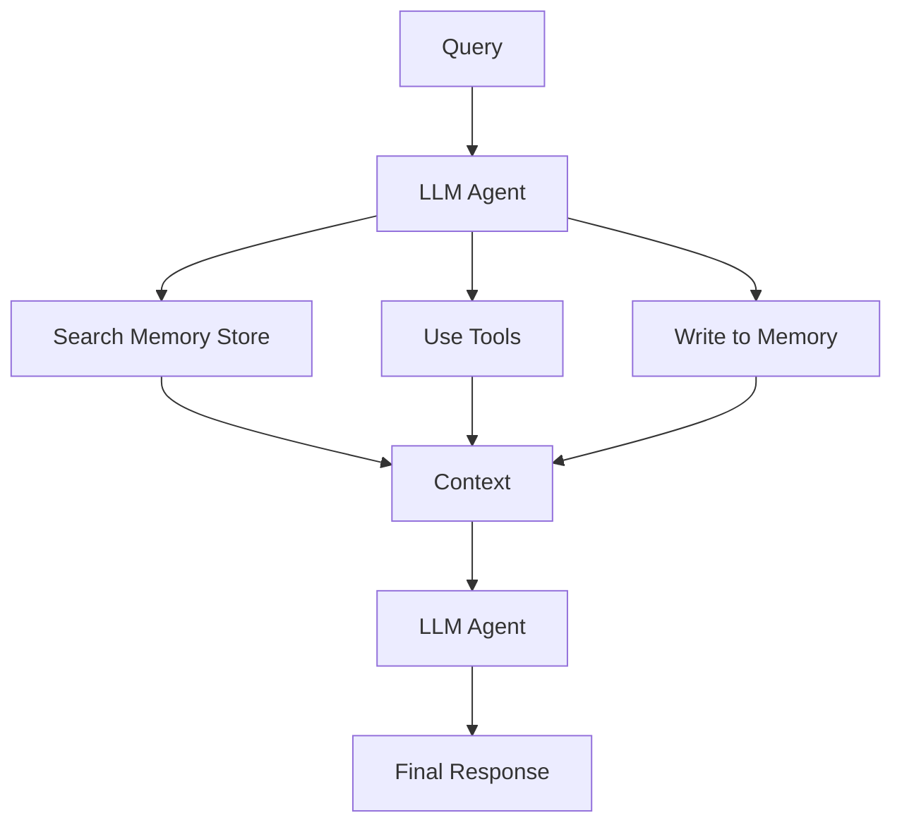

Here you go—clean, GitHub-ready **Mermaid diagrams** for all three pipelines **+** a polished explanation suitable for your AI chapter.

---

# ✅ Mermaid Diagrams (Copy/Paste into GitHub)

## **1. RAG**

---

## **2. Agentic RAG**

---

## **3. AI Memory**

---

# ✅ Cleaned & Enhanced Explanation (Chapter-Ready)

### **The Evolution: RAG → Agentic RAG → AI Memory**

For years, Retrieval-Augmented Generation (RAG) was treated as “the solution”—but it was really only the first step. Modern AI systems are moving rapidly toward **memory-driven agents** capable of learning, adapting, and improving over time.

---

## **1. RAG (2020–2023): The Static Era**

RAG is fundamentally **read-only**:

* The model embeds your query
* Retrieves documents once
* Generates an answer
* And forgets everything immediately

It doesn’t reason about *whether* retrieval is needed, and it often fetches irrelevant chunks. RAG improves accuracy, but it doesn't create intelligence.

**Mental model →** *One-shot retrieval + answer.*

---

## **2. Agentic RAG: Tools + Decision-Making**

Agentic RAG adds a layer of reasoning on top of RAG:

* The agent decides **when** to retrieve
* Chooses **which** tool to use
* Evaluates whether the retrieved data is useful
* Chains multiple steps if needed

But it still operates in a **read-only** world.
It can look things up, but it can’t *learn* from the interaction.

**Mental model →** *Read-only retrieval with decision-making.*

---

## **3. AI Memory: The Future of Intelligent Agents**

AI Memory introduces **read-write intelligence**:

* The agent can **store** new knowledge
* It can **recall** earlier context
* It personalizes itself over time
* It adapts to user preferences
* It supports episodic, semantic, and procedural memory

This unlocks true **continual learning**.

Instead of resetting on every query, the agent accumulates experience—just like a person.

**Mental model →** *An adaptive agent with external, persistent memory.*

---

# 🌱 Why Memory Changes Everything

When an agent can write information back to an external memory store, it can:

* Track long-term projects
* Remember personal details
* Store corrections and feedback
* Build richer situational awareness
* Improve without retraining

Memory is the missing bridge between static LLMs and truly adaptive AI systems.

---

# ⚠️ The New Challenge: Managing Memory

With power comes new complexity:

* What should be stored?
* What should be forgotten?
* How do we prevent contradictions?
* How do we combine episodic + semantic memory structures?

These are non-trivial design questions.
Systems like **Graphiti** help by turning memory into a structured, real-time knowledge graph that agents can reliably read and write.

---

If you want, I can:

✅ Add these diagrams to your GitHub repo structure
✅ Generate SVGs for documentation
✅ Write a full chapter section for your AI book
✅ Add a comparison table (RAG vs Agentic RAG vs Memory)
