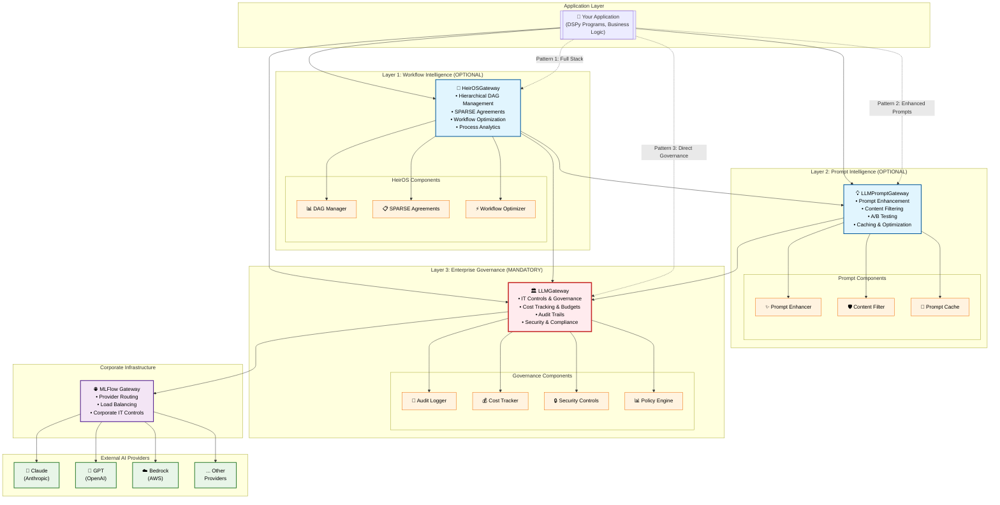

```mermaid
graph TB
    %% Application Layer
    subgraph "Application Layer"
        APP[["🎯 Your Application<br/>(DSPy Programs, Business Logic)"]]
    end
    
    %% Optional Gateway Layer 1 - Workflow Intelligence
    subgraph "Layer 1: Workflow Intelligence (OPTIONAL)"
        HEIROS["🔄 HeirOSGateway<br/>• Hierarchical DAG Management<br/>• SPARSE Agreements<br/>• Workflow Optimization<br/>• Process Analytics"]
        
        subgraph "HeirOS Components"
            DAG["📊 DAG Manager"]
            SPARSE["📋 SPARSE Agreements"] 
            OPT["⚡ Workflow Optimizer"]
        end
        
        HEIROS --> DAG
        HEIROS --> SPARSE
        HEIROS --> OPT
    end
    
    %% Optional Gateway Layer 2 - Prompt Intelligence  
    subgraph "Layer 2: Prompt Intelligence (OPTIONAL)"
        PROMPT["💡 LLMPromptGateway<br/>• Prompt Enhancement<br/>• Content Filtering<br/>• A/B Testing<br/>• Caching & Optimization"]
        
        subgraph "Prompt Components"
            ENHANCE["✨ Prompt Enhancer"]
            FILTER["🛡️ Content Filter"]
            CACHE["💾 Prompt Cache"]
        end
        
        PROMPT --> ENHANCE
        PROMPT --> FILTER  
        PROMPT --> CACHE
    end
    
    %% Mandatory Gateway Layer - Enterprise Governance
    subgraph "Layer 3: Enterprise Governance (MANDATORY)"
        LLM["🏛️ LLMGateway<br/>• IT Controls & Governance<br/>• Cost Tracking & Budgets<br/>• Audit Trails<br/>• Security & Compliance"]
        
        subgraph "Governance Components"
            AUDIT["📝 Audit Logger"]
            COST["💰 Cost Tracker"]
            SEC["🔒 Security Controls"]
            POLICY["📊 Policy Engine"]
        end
        
        LLM --> AUDIT
        LLM --> COST
        LLM --> SEC
        LLM --> POLICY
    end
    
    %% MLFlow Gateway Layer
    subgraph "Corporate Infrastructure"
        MLFLOW["🌐 MLFlow Gateway<br/>• Provider Routing<br/>• Load Balancing<br/>• Corporate IT Controls"]
    end
    
    %% External Providers
    subgraph "External AI Providers"
        CLAUDE["🤖 Claude<br/>(Anthropic)"]
        GPT["🧠 GPT<br/>(OpenAI)"]
        BEDROCK["☁️ Bedrock<br/>(AWS)"]
        OTHER["... Other<br/>Providers"]
    end
    
    %% Flow Connections
    APP --> HEIROS
    APP --> PROMPT  
    APP --> LLM
    
    HEIROS --> PROMPT
    HEIROS --> LLM
    PROMPT --> LLM
    
    LLM --> MLFLOW
    
    MLFLOW --> CLAUDE
    MLFLOW --> GPT
    MLFLOW --> BEDROCK
    MLFLOW --> OTHER
    
    %% Usage Pattern Labels
    APP -.->|"Pattern 1: Full Stack"| HEIROS
    APP -.->|"Pattern 2: Enhanced Prompts"| PROMPT
    APP -.->|"Pattern 3: Direct Governance"| LLM
    
    %% Styling
    classDef optional fill:#e1f5fe,stroke:#01579b,stroke-width:2px,color:#000
    classDef mandatory fill:#ffebee,stroke:#c62828,stroke-width:3px,color:#000
    classDef infrastructure fill:#f3e5f5,stroke:#4a148c,stroke-width:2px,color:#000
    classDef providers fill:#e8f5e8,stroke:#2e7d32,stroke-width:2px,color:#000
    classDef components fill:#fff3e0,stroke:#ef6c00,stroke-width:1px,color:#000
    
    class HEIROS,PROMPT optional
    class LLM mandatory
    class MLFLOW infrastructure
    class CLAUDE,GPT,BEDROCK,OTHER providers
    class DAG,SPARSE,OPT,ENHANCE,FILTER,CACHE,AUDIT,COST,SEC,POLICY components
```