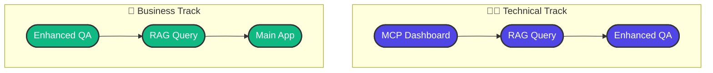

# 🚀 Ready to Launch

## ▶️ Start Your Demo

```sh
# Run the following to start your demo
./start_demo.sh
```

---

## 🌐 Available Apps

* **MCP Dashboard** → [http://localhost:8504](http://localhost:8504)  
  *(System overview)*
* **Enhanced QA** → [http://localhost:8502](http://localhost:8502)  
  *(Document processing)*
* **RAG Query** → [http://localhost:8503](http://localhost:8503)  
  *(Intelligent search)*
* **Main App** → [http://localhost:8501](http://localhost:8501)  
  *(Complete pipeline)*

---

## 📋 Demo Flow Recommendations

### 👨‍💻 Technical Audience


✅ **MCP Dashboard** → Show system architecture  
✅ **RAG Query** → Highlight technical capabilities  
✅ **Enhanced QA** → Demonstrate practical applications

---

### 💼 Business Audience


✅ **Enhanced QA** → Emphasize business value  
✅ **RAG Query** → Showcase user experience  
✅ **Main App** → Present the complete solution

---

## 🎯 Key Features

This demo setup provides:
- ✅ **Technical flow** shows progression in **blue**
- ✅ **Business flow** shows progression in **green**  
- ✅ Both have clear checklists for guidance
- ✅ GitHub-compatible Mermaid diagrams
- ✅ Responsive design for all screen sizes

## 💡 Pro Tip

Need both flows in one diagram? Here's a **combined view**:


