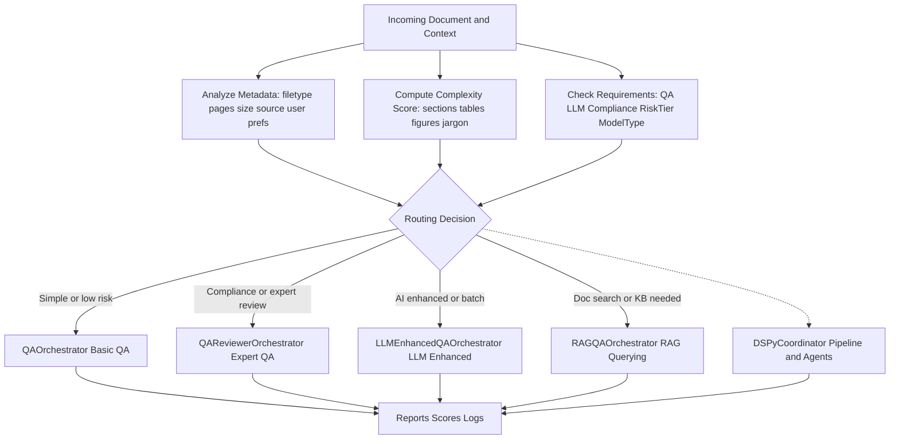
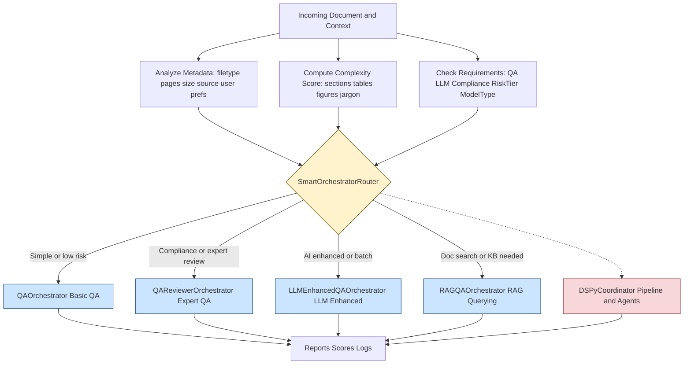

Got it 👍 — I’ll re-format your **Total Orchestrators.MD** into a clear, well-structured Markdown doc with sections, code locations, and a summary table.

---

# **Total Orchestrators: 6**

## 1. Core Orchestrators (4)

* **QAOrchestrator** (`qa_orchestrator.py`)
  *Basic QA processing*
* **QAReviewerOrchestrator** (`qa_reviewer_orchestrator.py`)
  *Expert QA with compliance assessment*
* **LLMEnhancedQAOrchestrator** (`llm_enhanced_qa_orchestrator.py`)
  *AI-powered enhanced processing*
* **RAGQAOrchestrator** (`rag_qa_orchestrator.py`)
  *RAG-based document querying and analysis*

---

## 2. Coordination Orchestrators (2)

* **SmartOrchestratorRouter** (`smart_orchestrator_router.py`)
  *Intelligent routing between orchestrators*
* **DSPyCoordinator** (`dspy_coordinator.py`)
  *DSPy framework coordination*

---

## **Orchestrator Capabilities Summary**

| Orchestrator         | Complexity | Expertise Level | Key Capabilities                                                |
| -------------------- | ---------- | --------------- | --------------------------------------------------------------- |
| **Basic QA**         | Low        | Basic           | Document processing, basic QA, simple reports                   |
| **Expert QA**        | High       | Expert          | Compliance assessment, professional reports, session management |
| **LLM Enhanced**     | Medium     | Enhanced        | LLM analysis, document classification, batch processing         |
| **RAG QA**           | High       | Expert          | RAG-based querying, database integration, intelligent search    |
| **Smart Router**     | Medium     | All Levels      | Intelligent routing, automatic selection                        |
| **DSPy Coordinator** | Medium     | Enhanced        | DSPy framework integration                                      |

---

## **Smart Router Selection Logic**

The **SmartOrchestratorRouter** automatically selects the best orchestrator based on:

* Document complexity score
* File types and sizes
* QA / LLM / Compliance requirements
* User preferences
* Workflow context (risk tier, model type)

---

## 📁 **Code Structure**

### **Main Orchestrator Directory**

```
src/backend/mcp/orchestrators/
```

### **Key Files**

* `qa_orchestrator.py` – Basic QA Orchestrator
* `qa_reviewer_orchestrator.py` – Expert QA Orchestrator
* `llm_enhanced_qa_orchestrator.py` – LLM Enhanced Orchestrator
* `rag_qa_orchestrator.py` – RAG QA Orchestrator
* `smart_orchestrator_router.py` – Smart Router
* `dspy_coordinator.py` – DSPy Coordinator

### **Coordinator / Integration**

* `__init__.py` exports orchestrators for clean imports
* **Smart Router** manages routing between the 3 main QA orchestrators
* **DSPy Coordinator** integrates DSPy workflows

### **Demo Interfaces**

* `src/rag_query_demo.py` – RAG Query Interface
* `src/enhanced_qa_demo.py` – Enhanced QA Demo
* `src/qa_demo.py` – Basic QA Demo

---

✅ **Answer:** There are **6 orchestrators total**. The **Smart Router** intelligently switches between the 3 QA orchestrators (Basic, Expert, LLM Enhanced), while the **RAG QA** and **DSPy Coordinator** cover specialized querying and framework integration.

---


Demo apps use the Smart Router for intelligent selection
RAG Orchestrator is specialized for document querying
DSPy Coordinator handles framework integration
The structure is well-organized with clear separation of concerns and easy import paths!
