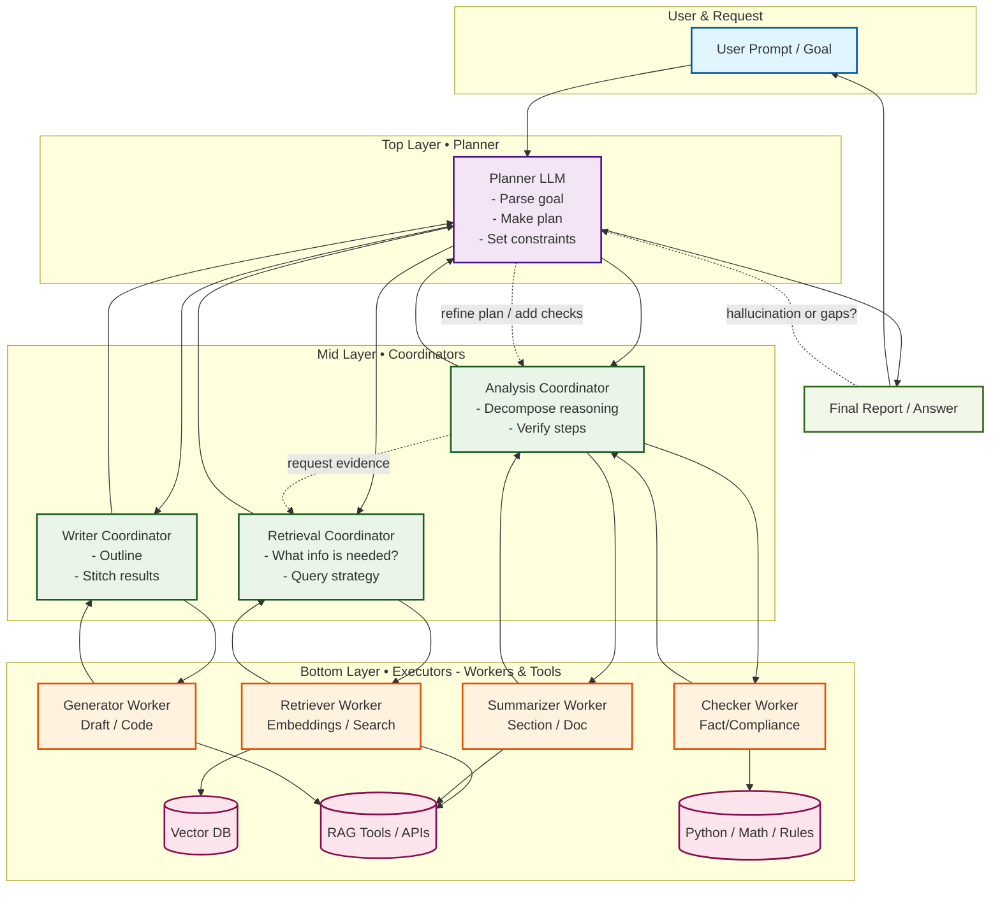

## **What Are Hierarchical LLMs?**

A **hierarchical LLM** is an AI system where multiple language models (or reasoning modules) are organized in a **layered structure**, like a pyramid. Each layer (or level) has a different role:

* **High-level models** handle planning, summarization, or breaking a task into steps.
* **Mid-level models** coordinate specific subtasks.
* **Low-level models** handle execution, such as retrieving facts, generating text, or solving math.

Think of it like a company:

* **CEO (top LLM):** Sets strategy (“We need a report”).
* **Managers (middle LLMs):** Break strategy into tasks (“Summarize each document, check compliance”).
* **Employees (worker LLMs/tools):** Do the work (“Extract table from PDF, run embedding search”).

---

## **Why Use a Hierarchy?**

* **Efficiency:** Instead of one big LLM trying to do everything, smaller specialized models handle pieces.
* **Scalability:** You can plug in different models for different tasks (e.g., math solver, code generator).
* **Explainability:** Easier to trace what went wrong when tasks are modular.
* **Cost savings:** Heavy models only run where needed.

---

## **Key Components**

1. **Planner (top level):**

   * Interprets the user’s request.
   * Chooses a strategy (e.g., “Decompose into 3 subtasks”).
   * Delegates tasks downward.

2. **Coordinators (middle level):**

   * Oversee a category of tasks.
   * Example: one coordinator for *document retrieval*, another for *fact-checking*.

3. **Executors (bottom level):**

   * Small or specialized models (or tools) that do concrete work.
   * Example: an embedding retriever, a Python script, or a fine-tuned classifier.

---

## **Example: Hierarchical LLM in Action**

**Task:** “Generate a compliance report from 50 documents.”

1. **Top LLM (Planner):**

   * Splits into steps: (a) collect docs, (b) summarize sections, (c) check compliance, (d) write final report.

2. **Mid LLMs (Coordinators):**

   * **Summarizer coordinator:** Assigns docs to summarization workers.
   * **Compliance coordinator:** Runs QA agents on extracted rules.
   * **Writer coordinator:** Collects results and drafts the report.

3. **Low-level Workers:**

   * Extract text with OCR.
   * Run embeddings to retrieve similar policies.
   * Apply fine-tuned compliance classifier.

---

## **Architectural Patterns**

* **Tree-of-Thoughts (ToT):** Planner explores multiple reasoning branches before deciding.
* **Hierarchical Reinforcement Learning (HRL):** Each layer optimizes its part of the problem.
* **Mixture of Experts (MoE):** Different LLMs specialized for subdomains (math, legal, medical).
* **Agent Hierarchies (DSPy, LangChain, AutoGPT):** Agents delegate tasks across levels.

---

## **Where They’re Used**

* **Document Governance:** One model assigns tasks (summarization, compliance check) to others.
* **Customer Service:** High-level LLM routes tickets to domain-specific agents.
* **Robotics:** High-level planner sets goals, mid-level decides actions, low-level executes motor control.
* **Research & Reasoning:** Hierarchical prompting improves logical accuracy vs. flat prompting.

---

✅ In short: **Hierarchical LLMs = “divide-and-conquer with multiple AI brains.”**
They mimic how humans delegate and specialize, making complex tasks manageable and more reliable.

---
 **Mermaid** diagram of a hierarchical LLM workflow:

