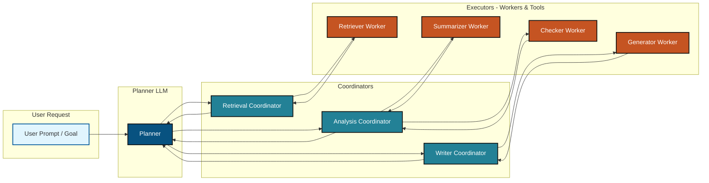
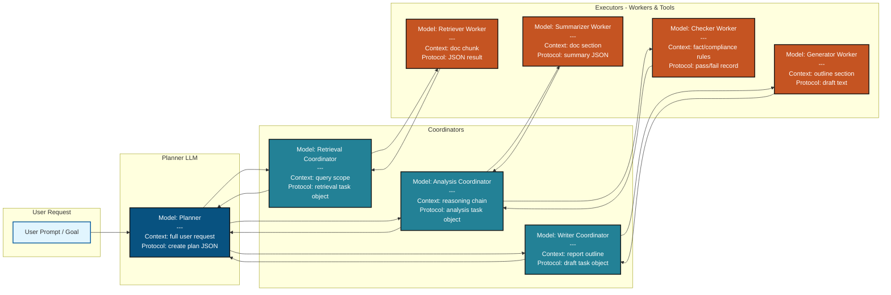

## **What is MCP?**

MCP is a **framework for structuring how LLMs (or agents) interact**.
It has three core parts:

1. **Model** – the reasoning or generation engine (LLM, classifier, math solver).

   * “What is thinking?”
   * Example: GPT-5 generating text, a fine-tuned classifier, or a DSPy module.

2. **Context** – the data, history, and environment given to the model.

   * “What does it know right now?”
   * Example: user prompt, retrieved docs, embeddings, session memory.

3. **Protocol** – the rules and methods for communication and orchestration.

   * “How do the parts talk and coordinate?”
   * Example: JSON API calls, function-calling schema, DSPy signatures, LangChain chains.

---

## **MCP in a Hierarchical LLM**

When you apply **MCP** to a hierarchical setup, it acts like the **operating system layer** ensuring order and clarity across Planner → Coordinators → Executors.

### **1. Model Layer**

* Each node in the hierarchy (Planner, Coordinator, Worker) is a **model** (or agent).
* Models can be large (generalist LLMs) or small/specialized (retriever, rules checker).

### **2. Context Layer**

* Context flows *down* the hierarchy and is enriched along the way.
* Example:

  * Planner gets **global context**: “Generate compliance report from 50 docs.”
  * Coordinator adds **scoped context**: “Focus only on sections tagged Risk Tier.”
  * Worker gets **micro context**: “Summarize section 3 of Doc A in 200 words.”

### **3. Protocol Layer**

* Defines **how messages are passed** between levels.
* Example:

  * JSON task objects: `{ "task": "summarize", "doc_id": "A", "section": 3 }`
  * Function calls: `summarize(doc_chunk, constraints)`
  * Error handling: retries, validations, logging.

---

## **Putting It Together**

Here’s how MCP organizes a hierarchical LLM workflow:

1. **Planner (Model)**

   * Reads **user context** (goal, constraints).
   * Uses **protocol** to break the task into sub-calls.

2. **Coordinator (Model)**

   * Accepts structured task object (protocol).
   * Adds **local context** (which docs, which section).
   * Delegates to Workers.

3. **Workers (Models)**

   * Run specific LLMs or tools.
   * Get **narrow context** (a doc chunk, a formula).
   * Return results in a **protocol-defined format** (JSON, structured text).

4. **Aggregation**

   * Results bubble back up the tree.
   * Protocol ensures standard format, so Planner can recombine outputs.
   * Final Model produces report/answer.

---

## **Analogy**

* **Hierarchical LLM** = a company with CEO, managers, workers.
* **MCP** = the *operating manual* that says:

  * What each role does (Model).
  * What info they need (Context).
  * How they hand off work (Protocol).

---

✅  Without MCP, delegation can get messy (hallucinations, mismatched formats). 

---

Here's a hierarchical LLM diagram:

---

✅  **MCP gives hierarchical LLMs a structured, standardized way to “think, know, and talk.”**
Without MCP, delegation can get messy (hallucinations, mismatched formats). With MCP, every layer uses the same communication contract.

---

Here's a more detailed MCP hierarchical LLM diagram :

## This diagram shows:

### **MCP Framework Applied to Hierarchical LLMs:**

**🔵 Planner Level (Dark Blue)**
- **Model**: Strategic reasoning engine
- **Context**: Full user request and constraints  
- **Protocol**: Creates structured plan JSON

**🟢 Coordinator Level (Teal)**
- **Model**: Tactical coordination agents
- **Context**: Scoped information for their domain
- **Protocol**: Domain-specific task objects

**🟠 Worker Level (Orange)**  
- **Model**: Specialized execution engines
- **Context**: Micro-context for specific tasks
- **Protocol**: Standardized result formats

**🔷 User Input (Light Blue)**
- Initial request that triggers the hierarchy

### **Key MCP Benefits Shown:**
1. **Structured Communication**: Each level has clear Model-Context-Protocol definitions
2. **Context Flow**: Information gets more specific as it flows down
3. **Protocol Consistency**: Standardized formats enable clean aggregation
4. **Hierarchical Clarity**: Colors distinguish strategic vs tactical vs operational levels

---

✅  This  demonstrates how MCP provides the "operating system" for hierarchical LLM workflows!

---

