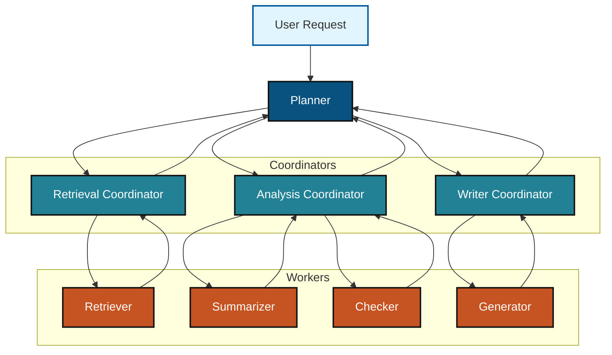
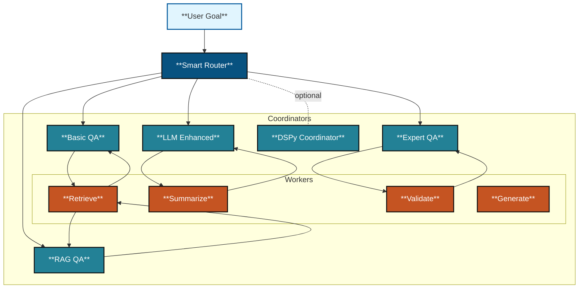

Got it ✅ — here’s a **GitHub-safe Markdown** you can drop into `orchestrators.md`.
It has no ` `, no special characters inside Mermaid, and uses Mermaid **`style`** for coloring.

---

# **What is MCP?**

MCP is a **framework for structuring how LLMs (or agents) interact**.
It has three core parts:

1. **Model** – the reasoning or generation engine.
   *“What is thinking?”*
   Example: GPT-5, a classifier, a DSPy module.

2. **Context** – the data, history, and environment given to the model.
   *“What does it know right now?”*
   Example: user prompt, retrieved docs, embeddings, session memory.

3. **Protocol** – the rules and methods for communication and orchestration.
   *“How do the parts talk and coordinate?”*
   Example: JSON tasks, function calls, DSPy signatures.

---

# **MCP in a Hierarchical LLM**

When applied hierarchically, MCP acts like an **operating system layer** across Planner → Coordinators → Workers.

* **Model Layer:** each node is a model (planner, coordinator, worker).
* **Context Layer:** context flows downward, becoming more specific.
* **Protocol Layer:** standard message formats keep results consistent.

---

# **Diagram 1 — Generic Hierarchy with MCP**

---

# **Diagram 2 — Your Orchestrators under MCP**

---

# **Key Takeaways**

* **Planner (Yellow):** SmartOrchestratorRouter routes tasks.
* **Coordinators (Blue):** orchestrators add domain-specific context.
* **DSPy (Red):** wraps or coordinates other orchestrators.
* **Workers (Orange):** execute micro-tasks with narrow context.
* **User (Light Blue):** triggers the hierarchy.

---

Would you like me to also add a **compact summary diagram** (just 6 boxes with colors, no hierarchy) that works great in slide decks?
